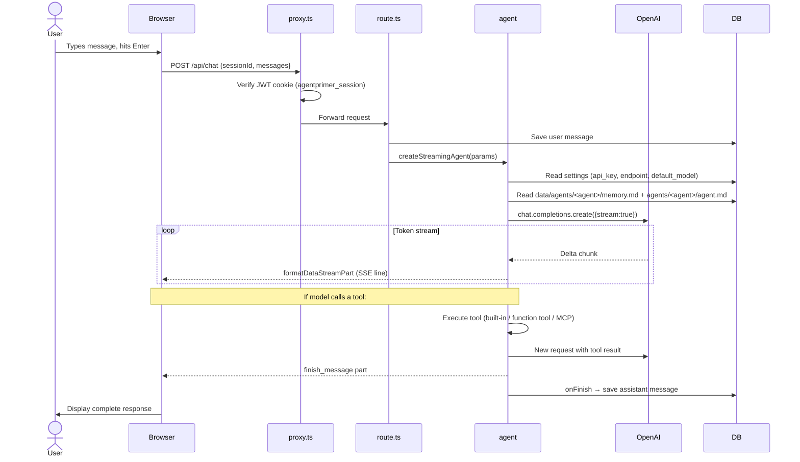

# Module 01 — System Architecture

← [README](./README.md) | Next: [Agent Loop →](./02-agent-loop.md)

---

## Learning Objectives

After reading this module you will be able to:
- Draw the full component map of AgentPrimer from browser to LLM
- Explain each layer's responsibility and why it exists
- Trace a single chat turn through the entire system
- Explain why each technology in the stack was chosen over alternatives
- Identify where to add new features in the file layout

---

## What Is an AI Agent (vs a Chatbot)?

Before diving into the architecture, it is worth being precise about terminology.

| | Chatbot | AI Agent |
|--|---------|----------|
| **Input** | Text | Text, files, tool results |
| **Output** | Text | Text + **actions** |
| **LLM calls per turn** | 1 | 1 to N (loop) |
| **External systems** | None | Files, APIs, databases, sub-processes |
| **State** | Per-session only | Long-term memory across sessions |
| **Autonomy** | Passive (only responds) | Active (plans multi-step tasks) |

The key insight is that an agent is not a smarter chatbot — it is a **loop** that repeatedly gives the LLM the results of its own actions until a task is fully complete. The architecture of AgentPrimer is built entirely around enabling and controlling this loop safely.

---

## High-Level Component Diagram

```mermaid
graph TB
    Browser["Browser\n(React / Next.js)"]
    Proxy["proxy.ts\n(JWT auth middleware)"]
    Chat["app/api/chat/route.ts\n(POST /api/chat)"]
    Agent["lib/agent/streaming-agent.ts\n(createStreamingAgent)\n+ lib/agent/loop.ts (runAgentLoop)"]
    LLM["OpenAI-compatible API\n(DeepSeek, OpenAI, Ollama…)"]
    DB["data/db/agent.db\n(better-sqlite3)\nchats · settings · RAG · tasks"]
    Skills["SKILL.md skills\n(context injection)"]
    FuncTools["Function tool subprocesses\n(lib/function-tool-worker.js)"]
    MCP["MCP servers\n(stdio / SSE)"]
    FS["Host filesystem\n(built-in FS tools)"]
    Memory["data/agents/<agent>/memory.md\ndata/agents/<agent>/agent.md\ndata/system.md"]
    Embed["lib/embeddings.ts\n(in-process Transformers.js)\nall-MiniLM-L6-v2 ONNX · local embeddings"]

    Browser -- "POST /api/chat (streaming)" --> Proxy
    Proxy -- "validates JWT cookie" --> Chat
    Chat -- "createStreamingAgent()" --> Agent
    Agent -- "openai.chat.completions.create(stream:true)" --> LLM
    LLM -- "token stream" --> Agent
    Agent -- "injected into system prompt" -.-> Skills
    Agent -- "execute()" --> FuncTools
    Agent -- "callTool()" --> MCP
    Agent -- "fs.readFile / unlink…" --> FS
    Agent -- "reads at startup" --> Memory
    Agent -- "saves response" --> DB
    Agent -- "search_knowledge_base" --> DB
    Chat -- "reads settings / saves messages" --> DB
    Browser -- "GET /api/sessions, /api/rag, etc." --> Chat
    Agent -- "embedTexts() in-process" --> Embed
    Embed -- "float[][]" --> Agent
```

**Reading the diagram:**

1. The **Browser** is a Next.js React app — it sends POST requests and reads chunked responses via the `useChat` hook.
2. **proxy.ts** is the authentication middleware. It intercepts every request and verifies the JWT cookie (`agentprimer_session`) before anything else runs. For page routes it redirects unauthenticated requests to `/login` (HTTP 307); for `/api/*` routes it returns `{ error: 'Unauthorized' }` with HTTP 401. The JWT secret comes from the `AGENT_PRIMER_SECRET` environment variable (required in production).
3. **`app/api/chat/route.ts`** is the entry point for all agent conversations. It saves the user message, then calls `createStreamingAgent()`.
4. **`lib/agent/streaming-agent.ts`** + **`lib/agent/loop.ts`** are the heart of the system. `lib/agent.ts` itself is just a 28-line barrel re-exporting from `lib/agent/*.ts`; the real implementation lives in fourteen smaller modules (`types.ts`, `openai-client.ts`, `schema.ts`, `sanitize.ts`, `usage.ts`, `stream.ts`, `reasoning.ts`, `messages.ts`, `finalize.ts`, `prompt.ts`, `model-resolver.ts`, `builtin-tools.ts`, `loop.ts`, `streaming-agent.ts`). Covered in depth in [Module 02](./02-agent-loop.md).
5. The **LLM** (OpenAI-compatible API) provides language intelligence. Any provider that implements `POST /v1/chat/completions` works here. Provider URL and API key are read from the SQLite `settings` table — **not** from `OPENAI_BASE_URL` / `OPENAI_API_KEY` environment variables.
6. **`data/db/agent.db`** holds most persistent state (chats, settings, RAG, tasks, lessons, token usage). Some state still lives on disk under `data/` — `data/.users` (auth), `data/agents/<agent>/*.md`, `data/system.md`, `data/skills/`, `data/function-tools/`, `data/mcp-servers/`, `data/agent-files/`, `data/uploads/`, `data/models/`.
7. **Function-tool subprocesses**, **SKILL.md instruction modules**, and **MCP servers** extend the agent's capabilities. These are covered in [Module 03](./03-tools-and-skills.md).

---

## Request Flow (One Chat Turn)



**Key insight:** The user message is saved to the database *before* the agent runs (line: `route.ts->>DB: Save user message`). This means a server crash mid-response will not lose the user's input — they can reload and the conversation history will be intact up to that message.

---

## Layered Architecture: Separation of Concerns

It helps to think of the system in four distinct layers:

```
┌────────────────────────────────────────────────┐
│  PRESENTATION LAYER                            │
│  app/(main)/chat/page.tsx, components/                │
│  React + useChat hook + SSE stream consumer    │
├────────────────────────────────────────────────┤
│  API LAYER                                     │
│  app/api/chat/route.ts                         │
│  Request validation, session management,       │
│  response serialisation, DB writes            │
├────────────────────────────────────────────────┤
│  AGENT LAYER  ← the core of the system         │
│  lib/agent/*.ts (loop, streaming, tools,       │
│    finalize, prompt, model-resolver, …)        │
│  ReAct loop, tool dispatch, streaming output,  │
│  approval gate, multimodal fallback            │
│  (lib/agent.ts is just a re-export barrel)     │
├────────────────────────────────────────────────┤
│  INFRASTRUCTURE LAYER                          │
│  lib/db.ts, lib/auth.ts, lib/installer.ts      │
│  SQLite, JWT, git-clone for skill/MCP install  │
└────────────────────────────────────────────────┘
```

This separation makes the system easy to understand and extend: changes to the streaming protocol stay in the API layer; changes to tool logic stay in the agent layer; new tools can be added without touching the database or the frontend.

---

## File Layout

```
agentprimer/
├── app/
│   ├── (main)/
│   │   ├── chat/page.tsx            # Main chat UI (client component)
│   │   ├── chat/[id]/page.tsx       # Direct link to saved session
│   │   ├── agents/page.tsx          # Agent & memory file editor
│   │   ├── settings/page.tsx        # Provider/model/tool settings
│   │   ├── approvals/page.tsx       # Manage permanent approvals
│   │   ├── statistics/page.tsx      # Token usage statistics
│   │   ├── knowledge/page.tsx       # RAG UI
│   │   ├── skills/page.tsx          # Skills, function tools, MCP management
│   │   ├── tools/page.tsx           # Tool Playground
│   │   ├── editor/page.tsx          # Agent Files Monaco editor
│   │   ├── learn/page.tsx           # In-app curriculum dashboard
│   │   └── learn/[slug]/page.tsx    # In-app lesson player
│   ├── api/
│   │   ├── chat/route.ts            # POST /api/chat – streaming entry point
│   │   ├── approval/route.ts        # GET/POST/DELETE /api/approval
│   │   ├── sessions/                # CRUD for chat sessions
│   │   ├── messages/                # Fetch message history for a session
│   │   ├── settings/                # Read/write settings table
│   │   ├── ui-settings/             # UI-specific preferences
│   │   ├── system-prompt/route.ts   # GET composed system prompt for inspection
│   │   ├── reset/route.ts           # POST destructive data reset
│   │   ├── skills/                  # Install/toggle/delete skill packages
│   │   ├── builtin-tools/           # Enable/disable individual built-in tools
│   │   ├── mcp/                     # Install/toggle/delete MCP servers
│   │   ├── models/route.ts          # GET available models from the LLM endpoint
│   │   ├── agents/route.ts          # GET list of agents from data/agents/<agent>/agent.md
│   │   ├── memory/route.ts          # GET/PUT agents/<agent>/memory.md content
│   │   ├── function-tools/          # List/install/delete function tools
│   │   ├── learn/                   # Learning curriculum data
│   │   ├── files/[id]/              # Serve files created by the agent (send_file)
│   │   ├── upload/route.ts          # POST file upload (user attachments)
│   │   ├── uploads/[filename]/      # Serve uploaded files
│   │   ├── data-files/route.ts      # Read/write data/ markdown files
│   │   ├── workspace/               # Browse the workspace filesystem
│   │   ├── statistics/              # Token usage and turn counts
│   │   ├── rag/
│   │   │   ├── health/route.ts      # GET embedding provider health
│   │   │   ├── search/route.ts      # POST semantic/keyword search
│   │   │   ├── summarize/route.ts   # POST summarise for Send-to-RAG
│   │   │   └── sources/
│   │   │       ├── route.ts         # GET list + POST ingest document
│   │   │       ├── [id]/route.ts    # DELETE a knowledge source
│   │   │       └── [id]/content/route.ts # GET original document for View panel
│   │   └── auth/                    # Login / logout / register (JWT cookies)
│   ├── login/page.tsx               # Auth login
│   ├── register/page.tsx            # First-time admin registration
│   ├── setup/page.tsx               # Initial LLM setup wizard
│   └── layout.tsx                   # Root layout (fonts, global CSS)
│
├── components/
│   ├── ChatInput.tsx            # Multi-line input + file attachments (image, audio, text)
│   ├── ChatInterface.tsx        # Shared chat client component (useChat, state, callbacks)
│   ├── MessageBubble.tsx        # Thin orchestrator; delegates to components/message/* sub-renderers
│   ├── PreviewPanel.tsx         # Resizable panel for live HTML/image/PDF/Markdown previews
│   ├── RagViewerPanel.tsx       # Resizable RAG document preview panel (text, PDF, HTML)
│   ├── ResizableSidebar.tsx     # Draggable sidebar width
│   ├── Sidebar.tsx              # Session list + session action menu (pin, rename, delete)
│   ├── ModelSelector.tsx        # LLM model picker
│   ├── ThemeToggle.tsx          # Dark/light mode toggle
│   ├── WritingGuideModal.tsx    # Educational modal for agent.md/memory.md authoring
│   ├── SendToRagDialog.tsx      # Step-by-step dialog for sending chat content to RAG
│   ├── SystemPromptModal.tsx    # Inspect composed system prompt with tool metadata
│   ├── MarkdownContent.tsx      # Markdown renderer with syntax highlighting
│   ├── AuthGuard.tsx            # Client-side auth boundary
│   ├── BrandLogo.tsx            # Logo
│   ├── CodeEditorPanel.tsx      # Monaco wrapper
│   ├── MermaidBlock.tsx         # Mermaid diagram renderer
│   ├── chat/                    # Chat-screen sub-components
│   ├── editor/                  # Agent Files editor sub-components
│   ├── learn/                   # Learn page sub-components
│   ├── message/                 # MessageBubble sub-renderers (ToolCards, Reasoning, …)
│   └── ui/                      # Small shared UI primitives
│
├── lib/
│   ├── agent.ts                 # 28-line barrel re-exporting from lib/agent/*
│   ├── agent/
│   │   ├── streaming-agent.ts   # ★ createStreamingAgent — public entry point
│   │   ├── loop.ts              # ★ runAgentLoop — the ReAct loop itself
│   │   ├── builtin-tools.ts     # All 22 built-in tool implementations
│   │   ├── messages.ts          # useChat ↔ OpenAI conversion, multimodal injection, compaction
│   │   ├── stream.ts            # Chunk normalisation, <think> extractor, finish-reason mapping
│   │   ├── finalize.ts          # Structured-output finalize call
│   │   ├── prompt.ts            # System-prompt composition
│   │   ├── model-resolver.ts    # Agent-pinned model validation + fallback
│   │   ├── openai-client.ts     # Client factory + DI seam
│   │   ├── schema.ts            # Zod → OpenAI JSON Schema
│   │   ├── sanitize.ts          # Wire-payload sanitisers + JSON helpers
│   │   ├── usage.ts             # Provider-agnostic token usage normalizer
│   │   ├── reasoning.ts         # Two-level reasoning cache
│   │   ├── types.ts             # Shared types
│   │   └── index.ts             # Module barrel
│   ├── db.ts                    # SQLite layer (better-sqlite3) + all DB helpers + RAG schema
│   ├── memory.ts                # agents/<agent>/memory.md / agents/<agent>/agent.md / system.md helpers
│   ├── rag.ts                   # RAG pipeline: chunkText, embedTexts, ingestDocument, retrieveChunks
│   ├── embeddings.ts            # In-process local embedder (Transformers.js, all-MiniLM-L6-v2)
│   ├── skills-loader.ts         # Loads SKILL.md skills (context injection into system prompt)
│   ├── function-tools-loader.ts # Loads function tools (callable, runs in subprocess)
│   ├── function-tool-worker.js  # Subprocess entry point for function tool execution
│   ├── mcp-client.ts            # MCP protocol client (stdio + SSE)
│   ├── approval-store.ts        # Per-session and permanent approval tracking
│   ├── agent-files.ts           # Files sent by the agent to users (send_file)
│   ├── builtin-tools-registry.ts # Catalogue of 22 built-in tools (enable/disable UI)
│   ├── installer.ts             # Git-clone + npm-install for skills/MCP
│   ├── subagent-monitor.ts      # Background watcher for async sub-agent tasks
│   ├── learn-curriculum.ts      # Structured learning curriculum data (lessons, quizzes, experiments)
│   ├── langfuse.ts              # Optional Langfuse observability integration
│   ├── path-security.ts         # Sandboxed path resolution helpers
│   ├── preview-security.ts      # Preview panel CSP / sandbox policy
│   ├── model-lengths.ts         # KNOWN_CONTEXT_LENGTHS / KNOWN_OUTPUT_LENGTHS fallback tables
│   ├── schema-utils.ts          # JSON Schema → Zod schema converter
│   ├── bootstrap.ts             # First-run scaffolding under data/
│   ├── index.ts                 # lib barrel
│   └── auth.ts                  # JWT sign/verify helpers
│
├── proxy.ts                     # Next.js 16 middleware (auth gate — NOT middleware.ts)
├── data/                        # ★ Single volume mount point
│   ├── db/
│   │   └── agent.db             # SQLite — all persistent state (chats, settings, RAG, tasks, tokens)
│   ├── models/                  # Embedding model cache (Transformers.js ONNX, ~90 MB)
│   │                            # Populated on first RAG use with the local provider; persists across deploys
│   ├── system.md                # Global system prompt — prepended to every agent's prompt
│   ├── agents/<agent>/memory.md                # Agent's cross-session long-term memory
│   ├── agents/<agent>/agent.md                # Agent definitions (name, system prompt, tools, model, output schema)
│   ├── agent-files/             # Files the agent creates and sends to users (send_file)
│   │   └── <uuid>/<filename>
│   ├── skills/                  # Cloned SKILL.md skill packages
│   ├── function-tools/          # Cloned function tool packages
│   ├── mcp-servers/             # Cloned MCP server packages from GitHub
│   └── uploads/                 # Files uploaded by users in the chat input
└── docs/                        # ← You are here
```

---

## Technology Stack

| Layer | Technology | Why |
|-------|-----------|-----|
| Framework | **Next.js 16** (App Router) | Server-side streaming via Route Handlers; React client components for interactive pages |
| LLM API | **openai** npm package (`^6.39.0`) | Direct control over streaming; access to vendor-specific fields (`reasoning_content`) |
| Stream format | **Vercel AI SDK** (`ai@^4.3.19`) | `createDataStreamResponse` + `useChat` provide the SSE wire protocol for free |
| Database | **better-sqlite3** (`^12.11.1`) | Synchronous API fits Node.js without async overhead; WAL mode handles concurrent reads; stores all state including RAG vectors |
| Auth | **JWT** (`jose@^6.2.3`) | Stateless, works across multiple processes without a session store; secret from `AGENT_PRIMER_SECRET` env var |
| Validation | **Zod** (`^3.25.76`) | Type-safe schemas for tool parameters; converts to JSON Schema for the OpenAI API |
| MCP | **@modelcontextprotocol/sdk** (`^1.29.0`) | Official TypeScript SDK for stdio and SSE transports |
| Styling | **Tailwind CSS 4** | Utility classes; no build step beyond Next.js |
| Charts | **Recharts** | Token usage statistics bar charts |
| Embeddings (local) | **@huggingface/transformers** (Node, ONNX) | In-process via `lib/embeddings.ts`; all-MiniLM-L6-v2 model; 384-dim vectors; no GPU required |
| Embeddings (cloud) | **OpenAI** `text-embedding-3-small` | Optional; configurable in Settings; 1536-dim; better quality |
| Tests | **Vitest** (`^4.1.8`) | `npm test` runs `vitest run` |

---

## Why Each Technology Was Chosen

### Why `openai` npm package (not `@ai-sdk/openai`)?

The Vercel AI SDK provides a provider adapter (`@ai-sdk/openai`) that wraps the OpenAI API. Using it would be more convenient — but it strips out vendor-specific fields. For example, DeepSeek R1 returns a `reasoning_content` field alongside `content` that contains its internal chain-of-thought. The Vercel adapter silently discards this. By using the `openai` package directly, AgentPrimer can:
- Access `reasoning_content` and stream it to the browser as a "thinking" panel
- Echo reasoning back to the model on the next turn (required by the DeepSeek R1 API)
- Serve as a clear learning example: every API call is explicit

The Vercel AI SDK is still used for `createDataStreamResponse`, `formatDataStreamPart`, and `useChat` — these handle the SSE framing and browser-side stream consumption, which are complex enough to be worth reusing.

### Why `better-sqlite3` (not PostgreSQL or Prisma)?

- **Synchronous API** — Node.js is single-threaded; synchronous SQLite fits naturally without `async/await` wrappers that would complicate the agent loop code.
- **Zero external services** — the entire system runs in a single Docker container. No separate database container, no connection pool, no credentials.
- **WAL mode** — Write-Ahead Logging allows multiple readers without blocking the writer, which matters when multiple sessions are active simultaneously.
- **Simple deployment** — `data/db/agent.db` is a regular file; use SQLite's online `.backup` command for live WAL-mode backups.

**When to choose something else:** If you need multi-node deployments, full-text search across millions of messages, or real-time sync between users, move to PostgreSQL + Prisma.

### Why JWT (not sessions)?

JWT tokens are verified locally using a secret key — no database lookup is required on every request. This is important because `proxy.ts` (the middleware) runs on every request before any database is accessed. A stateless check keeps the auth gate fast.

**Trade-off:** JWTs cannot be individually revoked without a blocklist. If a user's token is compromised, the only defence is to change the secret key (which invalidates all sessions). For a single-user self-hosted tool this is acceptable; for multi-user production systems, add a token blocklist.

### Why Zod for tool parameters?

Zod schemas serve a dual purpose:
1. **Runtime validation** — tool arguments from the LLM are parsed and validated before the `execute()` function sees them. A malformed argument causes a clean error, not an unexpected crash.
2. **JSON Schema generation** — `zodToJsonSchema()` converts the Zod schema to the JSON Schema format required by the OpenAI API. This means you write the schema once and it works for both.

---

## Why `proxy.ts` instead of `middleware.ts`?

> ⚠️ This is one of the most important pieces of Next.js 16-specific knowledge in this codebase.

Next.js 16 changed the middleware filename convention. The middleware file must now be named `proxy.ts` (or `proxy.js`), not `middleware.ts`. The renamed convention is documented in the Next.js 16 release notes and in `node_modules/next/dist/docs/`.

If you name the file `middleware.ts`:
- Next.js silently ignores it
- The auth gate is completely bypassed
- All API routes become publicly accessible without authentication

Always verify the correct middleware filename for your specific Next.js version. AgentPrimer also exports a `config = { matcher: [...] }` from `proxy.ts` so Next.js knows which routes the proxy applies to.

---

## Alternate Architectures

AgentPrimer makes specific choices that work well for a self-hosted single-user tool. Here is how you would build the same system differently for different requirements:

| Requirement | Change |
|-------------|--------|
| **Multi-user SaaS** | Replace SQLite with PostgreSQL; add a `users` table with per-user settings; move `data/` to cloud storage |
| **Higher scalability** | Move the agent loop to a separate worker service (Redis queue + Bull); decouple from Next.js |
| **Mobile app** | Keep the API layer; replace `app/(main)/chat/page.tsx` with a React Native app |
| **No vendor lock-in** | Replace the `openai` package with a direct `fetch()` to any OpenAI-compatible endpoint (which AgentPrimer already does via the configurable `endpoint` setting) |
| **TypeScript SDK approach** | Use the OpenAI Agents SDK (Python) or LangGraph instead of a hand-written loop — faster to build, less transparent |

---

## Future Expansion

Areas where the architecture can grow without fundamental redesign:

1. **Sandboxed code execution** — The `run_shell` tool currently runs on the host. Replacing it with a Docker-based sandbox (like OpenClaw's OpenShell) would allow arbitrary code execution with hard resource and filesystem limits.
2. **Messaging channels** — The agent is currently browser-only. Adding a Telegram/WhatsApp adapter would send/receive messages through the same agent loop; the streaming response would be serialized to plain text.
3. **Plugin marketplace** — The skill/MCP install system can become a marketplace by adding a registry table and a browsable UI. The install logic in `lib/installer.ts` is already generic.
4. **Real-time collaboration** — Multiple users in the same session requires replacing `useChat`'s local state with a shared state layer (Socket.io or Partykit).
5. **Agent evaluation** — Add an `evaluations` table and a test runner that replays sessions with different models and measures response quality.
6. **Larger-scale vector search** — The current RAG uses pure-JS cosine similarity (O(n) scan), which is fine up to ~50k chunks. For larger RAG indexes, drop in the `sqlite-vec` extension for HNSW approximate nearest-neighbour search without changing `lib/rag.ts`'s API surface.

---

See: [Module 02 — Agent Loop →](./02-agent-loop.md)
