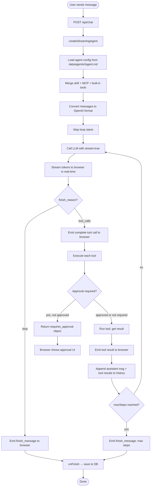
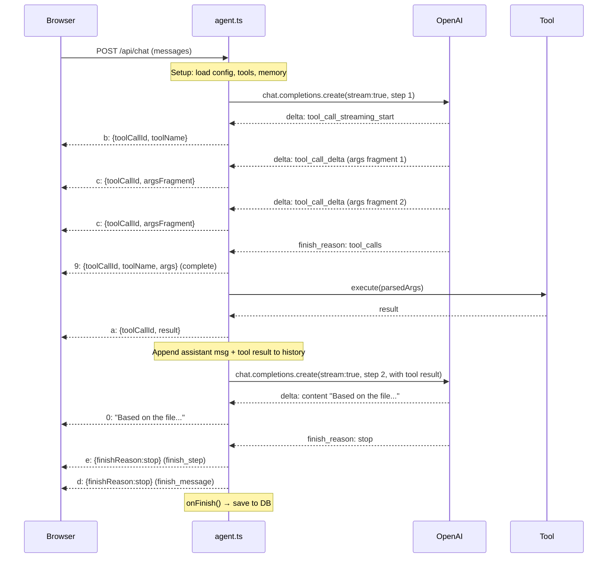
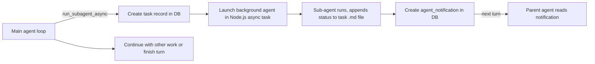

# Module 02 — The Agent Loop

← [Architecture](./01-architecture.md) | Next: [Tools & Skills →](./03-tools-and-skills.md)

---

## Learning Objectives

After reading this module you will be able to:
- Explain the ReAct (Reason + Act) pattern and why it enables multi-step tasks
- Trace exactly what happens inside `lib/agent.ts` on each agent turn
- Understand how streaming tool-call arguments are accumulated from fragments
- Explain the difference between synchronous and asynchronous sub-agents
- Identify the safety limits (maxSteps, timeouts) and why they exist

---

## What Is the Agent Loop?

A plain LLM API call produces text. An agent loop produces *results*.

The key difference: when the model decides to use a tool (`finish_reason: "tool_calls"`), a plain API call ends there — the caller receives raw JSON describing what the model *wanted* to do, but nothing actually happens. The agent loop detects this, **executes the tools**, appends the results to the message history, and calls the API again. This repeats until the model produces a text answer (`finish_reason: "stop"`).

This pattern is called **ReAct** — short for **Re**ason + **Act**. The name comes from the 2022 paper [ReAct: Synergizing Reasoning and Acting in Language Models](https://arxiv.org/abs/2210.03629) (Yao et al., 2022).

```
Reason: "The user wants to know the file count. I should list the directory."
  Act:   → call list_directory("/app")
  Observe: ["agent.ts", "db.ts", "memory.ts", ...]  ← tool result
Reason: "There are 8 files. I can answer now."
  Act:   → produce text: "There are 8 files in /app/lib."
```

Without the loop, the agent could only express *intent* to use a tool. With the loop, it can chain as many tool calls as needed to actually complete a task.

---

## Flow Diagram



---

## Step-by-Step Walkthrough

### Step 0: Bootstrap

`createStreamingAgent()` in [lib/agent.ts](../lib/agent.ts) performs setup before the loop starts:

```
0a. Resolve the agent name from the request body (default: "main")
0b. Read agent config (system prompt, allowed tools, model) from data/agents/<agent>/agent.md
0c. Read data/agents/<agent>/memory.md → inject into system prompt after the agent's own prompt
0d. Load function tools (from DB; each will execute in a subprocess)
0e. Load MCP tools (connect to all enabled MCP servers, call listTools())
0f. Load built-in tools (filtered by builtin-tools-registry — user can disable them)
0g. Inject SKILL.md skill descriptions into system prompt (Stage 1 discovery)
0h. Merge all callable tools: function tools → MCP tools → built-in tools
    (built-ins have highest priority; they cannot be shadowed)
0i. Filter tool allowlist from data/agents/<agent>/agent.md (if agent has Tools: list)
0j. Filter/sanitize incomplete tool invocations from message history
    (these appear when the browser was refreshed mid-stream)
0k. Convert useChat message format → OpenAI Chat API format
    (one useChat message can contain multiple agent "steps" with tool calls)
0l. Load last reasoning_content from cache (for thinking models, two-level cache:
    in-memory Map + SQLite setting keyed by sessionId)
0m. Resolve model priority:
    UI selector > agents/<agent>/agent.md **Model:** > DB default_model (set it in settings page)
```

### Step 1: LLM Call (Streaming)

```typescript
const stream = await openai.chat.completions.create({
  model: resolvedModel,
  messages: [
    { role: 'system', content: systemPrompt },  // agent prompt + memory
    ...conversationHistory,                      // all prior turns
  ],
  tools: openaiTools,        // undefined if no tools (some models reject empty array)
  tool_choice: 'auto',       // model decides when to call tools
  stream: true,
  stream_options: { include_usage: true },  // get token counts
});
```

`stream: true` returns an **async iterable** of delta objects. Each delta is a fragment — you must accumulate fragments across multiple chunks to get the complete response.

> **Why `stream: true` instead of a regular response?**
> Without streaming, the user sees nothing until the model finishes — which can take 10–60 seconds for long responses. With streaming, each token appears in the browser as soon as it is generated, giving a natural "typing" effect. See [Module 04](./04-streaming.md) for the full wire format.

### Step 2: Chunk Processing Loop

For each chunk from the stream:

| Delta field | What it means | Action |
|-------------|--------------|--------|
| `delta.content` | Text token | Append to `stepText`; emit `0:` part to browser |
| `delta.reasoning_content` | Chain-of-thought token | Append to `stepReasoning`; emit `g:` part to browser |
| `delta.tool_calls[i]` (name chunk) | Model wants to call a tool | Create accumulator entry keyed by `tc.index`; emit `b:` part |
| `delta.tool_calls[i].function.arguments` | Argument JSON fragment | Concat to accumulator's `args` string; emit `c:` part |
| `choice.finish_reason` | `"stop"` or `"tool_calls"` | Record for post-chunk decision |

**Why tool call arguments arrive as fragments:**

The OpenAI API streams tool call arguments as multiple JSON fragments, not as a single chunk. This is because the model generates JSON token by token, just like it generates text. AgentPrimer accumulates these fragments in a `Map` keyed by `tc.index`:

```
chunk 1: { index:0, id:"tc-0", function:{ name:"read_file" } }
chunk 2: { index:0, function:{ arguments:'{"p' } }
chunk 3: { index:0, function:{ arguments:'ath":' } }
chunk 4: { index:0, function:{ arguments:'"/app/agent.ts"}' } }
→ final: { id:"tc-0", name:"read_file", args:'{"path":"/app/agent.ts"}' }
```

Each fragment is forwarded to the browser as a `c:` delta part so the UI can show arguments streaming in real-time.

### Step 3: Post-Chunk Decision

After the stream ends (all chunks received):

```
if finish_reason == "stop":
    → Save reasoning to cache (two-level: in-memory + SQLite)
    → Emit finish_step + finish_message parts
    → Call onFinish(text, toolCalls, tokenUsage) → route.ts saves to DB
    → Return

if finish_reason == "tool_calls":
    → Execute tools (Step 4)
```

### Step 4: Tool Execution

For each completed tool call in this step:

1. **Emit `9:` (tool_call)** to browser — the UI shows the complete tool call with args
2. **Parse args** string as JSON (`JSON.parse(tc.args)`)
3. **Validate args** against the tool's Zod schema (throws on invalid input)
4. **Call `tools[tc.name].execute(args)`** — this is the actual tool function
5. **Emit `a:` (tool_result)** to browser — the UI shows the result
6. Collect result (or `{ error: ... }` if the tool throws)

### Step 5: History Update and Loop

```typescript
// Append the assistant's tool-call message
msgs.push({
  role: 'assistant',
  content: null,
  tool_calls: stepToolCalls,  // all tool calls from this step
});

// Append each tool result
for (const { toolCallId, result } of stepResults) {
  msgs.push({
    role: 'tool',
    tool_call_id: toolCallId,
    content: JSON.stringify(result),
  });
}

// Go back to Step 1 (unless maxSteps reached)
```

This is the core of the loop: the model's tool requests and their results become part of the conversation history, giving the model full context for its next decision.

---

## Sequence Diagram: Full Turn with Tool Call



---

## Message Format Conversion

The Vercel AI SDK's `useChat` hook stores messages in its own format. The OpenAI API requires a different format. `lib/agent.ts` bridges the two.

**useChat format (one message, multiple steps):**
```json
{
  "role": "assistant",
  "content": "The file contains 142 lines.",
  "toolInvocations": [
    { "toolCallId": "tc-0", "toolName": "read_file", "args": {"path": "/app.ts"},
      "result": "import React...", "state": "result", "step": 0 },
    { "toolCallId": "tc-1", "toolName": "stat_path", "args": {"path": "/app.ts"},
      "result": {"size": 3200, "lines": 142}, "state": "result", "step": 1 }
  ]
}
```

**OpenAI API format (same content, separate messages per step):**
```json
[
  { "role": "assistant", "content": null,
    "tool_calls": [{"id":"tc-0","type":"function","function":{"name":"read_file","arguments":"{\"path\":\"/app.ts\"}"}}] },
  { "role": "tool", "tool_call_id": "tc-0", "content": "import React..." },
  { "role": "assistant", "content": null,
    "tool_calls": [{"id":"tc-1","type":"function","function":{"name":"stat_path","arguments":"{\"path\":\"/app.ts\"}"}}] },
  { "role": "tool", "tool_call_id": "tc-1", "content": "{\"size\":3200,\"lines\":142}" },
  { "role": "assistant", "content": "The file contains 142 lines." }
]
```

The conversion function `convertMessagesToOpenAI()` handles this. It also re-attaches `reasoning_content` to the last assistant message so thinking models can continue their chain-of-thought.

---

## Safety Limits

| Limit | Value | What happens when reached |
|-------|-------|--------------------------|
| `maxSteps` | 100 by default (`max_agent_steps` setting) | Loop exits; emits `finish_message` with reason `"max-steps"` |
| Function tool timeout | 35 seconds | Subprocess is killed; tool returns `{ error: "timeout" }` |
| Function tool memory | 256 MB (`--max-old-space-size`) | Node.js OOM-kills the subprocess |
| MCP call timeout | 30 seconds | Client throws; tool returns `{ error: "timeout" }` |

These limits prevent runaway agents from consuming unbounded resources or getting stuck in infinite loops.

---

## Asynchronous Sub-agents

AgentPrimer uses `run_subagent_async` for delegation. The main agent fires off a task and continues. The task runs in the background using a separate non-streaming agent call. The result is delivered as a notification to the parent session.



| Property | Value |
|----------|-------|
| Streaming | No — progress written to a task `.md` file |
| Max steps | 20 hard-coded iterations for async sub-agents |
| Nesting | Async sub-agents can launch their own sub-agents |
| Monitoring | Parent can call `list_tasks` to check progress |
| Use case | Long-running tasks (research, code generation, file processing) |

---

## Reasoning Tokens (Thinking Models)

Some models (DeepSeek R1, o1, o3) emit a `reasoning_content` field in addition to `content`. This is the model's internal chain-of-thought — it reasons step-by-step before producing its answer.

**Why this matters for the loop:**
- The reasoning text must be *streamed to the browser* so the user can see the "Thinking..." panel
- The reasoning text must be *persisted between turns* and re-sent on the next API call, because the API requires echoing it back

AgentPrimer uses a two-level cache for this:
1. **In-memory `Map<sessionId, reasoning>`** — fast; survives as long as the Node.js process is running
2. **SQLite setting `reasoning:<sessionId>`** — survives server restarts

After a successful response, the previous reasoning is cleared so stale thoughts do not pollute unrelated future turns.

---

## Alternate Approaches to the Agent Loop

| Approach | Example | Trade-off |
|----------|---------|-----------|
| **Hand-written loop** (AgentPrimer's approach) | This codebase | Maximum transparency; full control over streaming, reasoning, multimodal; more code to maintain |
| **Vercel AI SDK `streamText` with `maxSteps`** | Most Next.js tutorials | Very concise; hides internal details; no access to reasoning_content |
| **LangChain/LangGraph** | LangChain (Python/JS) | Powerful abstractions for complex graphs; steep learning curve; many abstractions obscure what's happening |
| **OpenAI Assistants API** | OpenAI platform | Fully managed; no loop code needed; locked to OpenAI; no local model support |
| **OpenAI Agents SDK** | `openai-agents` Python package | Framework handles loop and handoffs; Python only; less frontend integration |

For learning purposes, AgentPrimer's hand-written loop is ideal: every step is explicit and traceable.

---

## Future Expansion

1. **Structured output / JSON mode** — Add `response_format: { type: 'json_object' }` to constrain the model's output to valid JSON. Useful for agents that produce structured reports.
2. **Parallel tool calls** — OpenAI and DeepSeek both support calling multiple tools simultaneously in one step. The current loop serializes tool execution; replacing it with `Promise.all()` would halve latency for independent tool calls.
3. **Retry with backoff** — If the LLM call fails with a rate-limit error (429), add exponential backoff before retrying. Currently a 429 surfaces as a stream error.
4. **Context window management** — When conversation history grows long, automatically summarize older messages instead of truncating them, using a dedicated summarization step.
5. **Agent interruption** — Allow the user to stop the agent mid-run by sending a signal that the streaming route handler can detect and use to break out of the loop.

---

## Exercises

1. **Trace a tool call manually:** Set a breakpoint in `lib/agent.ts` at the tool execution step. Send a message like "List all files in /app/lib" and trace through the code to see how the `list_directory` tool is called and its result is returned.

2. **Add a `console.log` step counter:** Inside the agent loop's `for` loop, log `Step ${step}: finish_reason = ${finishReason}`. Send a complex multi-step request and observe how many steps it takes.

3. **Observe streaming fragments:** Open the browser's Network tab, find the `/api/chat` request, and look at the response stream. Identify `b:`, `c:`, `9:`, and `a:` parts. Count how many fragments the tool call arguments were split into.

4. **Trigger maxSteps:** Set `maxSteps: 2` in a test call. Send a message that requires 3 tool calls (e.g., "read three different files"). Observe how the agent stops mid-task.

---

## Further Reading

- ReAct paper: Yao, S. et al. (2022). [ReAct: Synergizing Reasoning and Acting in Language Models](https://arxiv.org/abs/2210.03629). arXiv:2210.03629.
- OpenAI function calling: [Function calling guide](https://platform.openai.com/docs/guides/function-calling)
- DeepSeek R1 reasoning: [DeepSeek R1 technical report](https://github.com/deepseek-ai/DeepSeek-R1)
- Vercel AI SDK stream protocol: [AI SDK Data Stream](https://sdk.vercel.ai/docs/ai-sdk-ui/stream-protocol)

See: [Module 03 — Tools, Skills & MCP →](./03-tools-and-skills.md)
