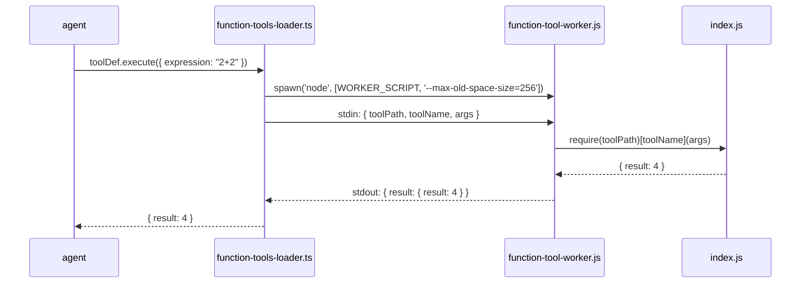

# Module 03 — Tools, Function Tools, Skills & MCP Servers

← [Agent Loop](./02-agent-loop.md) | Next: [Streaming Protocol →](./04-streaming.md)

---

## Learning Objectives

After reading this module you will be able to:
- Describe the four-tier architecture (built-in tools → function tools → MCP tools → SKILL.md skills)
- List all built-in tools and know when each one requires user approval
- Explain the difference between a **function tool** (callable code) and a **skill** (instruction module)
- Write a complete function tool from scratch and install it
- Write a complete SKILL.md skill and activate it
- Write a complete MCP server and connect it to AgentPrimer
- Understand when to use each mechanism

---

## The Four-Tier Architecture

AgentPrimer's agent capabilities come from **four sources**, each with different isolation guarantees and use cases:

```mermaid
graph TB
    Agent["lib/agent/streaming-agent.ts\n+ lib/agent/builtin-tools.ts\nToolSet assembly"]

    Builtin["Built-in Tools\n(run in main process)"]
    FuncTools["Function Tools\n(run in subprocess)"]
    MCP["MCP Tools\n(run in child process or remote)"]
    Skills["Skills (SKILL.md)\n(context injection — no callable code)"]

    Agent --> Builtin
    Agent --> FuncTools
    Agent --> MCP
    Agent -.->|injected into system prompt| Skills

    Builtin --> FS["Host filesystem\n(read, write, edit, delete, list…)"]
    Builtin --> SubAgent["run_subagent_async\n(delegate to another agent)"]
    Builtin --> MemWrite["append_memory / replace_memory\n(write to agents/<agent>/memory.md)"]
    Builtin --> Output["send_file / open_preview\n(deliver files to user)"]
    Builtin --> Shell["run_shell\n(execute shell commands — opt-in)"]

    FuncTools --> Worker["lib/function-tool-worker.js\n(isolated Node subprocess)"]
    Worker --> FuncCode["tool/index.js\n(your code)"]

    MCP --> STDIO["stdio MCP server\n(child process)"]
    MCP --> SSE["SSE/HTTP MCP server\n(remote)"]

    Skills --> SysPrompt["System prompt:\n\"## Available Skills\"\nAgent reads & follows instructions"]
```

**Why four tiers?**
- **Built-ins** run in the main process for maximum performance. They are trusted code written by the platform developers.
- **Function tools** run in isolated subprocesses. User-provided code can have bugs or malicious intent; a subprocess crash cannot take down the Next.js server.
- **MCP servers** can be completely separate processes or remote services, providing the strongest isolation. They also work with any MCP-compatible agent (not just AgentPrimer).
- **Skills (SKILL.md)** are *not* callable tools. They are instruction modules written in Markdown. Their content is injected into the agent's system prompt so the agent reads the instructions and follows them using its own reasoning — no code is executed.

---

## Tool Naming Convention

All callable tool keys (built-in, function tool, MCP) in the merged tool set follow a consistent naming scheme:

| Source | Format | Example |
|--------|--------|---------|
| Built-in | `snake_case` | `read_file`, `delete_path` |
| Function tool | `snake_case` (from `function.json`) | `calculator`, `random_data` |
| MCP | `servername__toolname` | `github__create_issue` |

**Skills (SKILL.md)** are NOT callable tools and do NOT appear in the tool set. They are injected into the system prompt as instructional text.

**Merge order**: function tools → MCP tools → built-in tools.
Built-ins have the highest priority: function tools and MCP servers cannot shadow `append_memory`, `run_subagent_async`, etc.

---

## Built-in Tools

All built-in tool **implementations** live in `lib/agent/builtin-tools.ts` (inside `createBuiltinTools()`); their **metadata** (label, category, enabled state, dangerous flag) lives in `lib/builtin-tools-registry.ts`. AgentPrimer ships **22 built-in tools**. Agents receive the full list unless a `Tools:` allowlist is set in `data/agents/<agent>/agent.md`, or a tool has been disabled in Settings.

### Complete Built-in Tool Reference

| Tool | Category | Approval? | Default? | Description |
|------|----------|-----------|----------|-------------|
| `send_file` | output | — | ✅ | Deliver a file in chat with inline preview (image/audio/video/PDF) and a download button |
| `open_preview` | output | — | ✅ | Open a file in the resizable Preview Panel (HTML live render, images, PDFs, Markdown editor) |
| `append_memory` | memory | — | ✅ | Append notes to `data/agents/<agent>/memory.md`; injected into every future system prompt |
| `replace_memory` | memory | — | ✅ | Overwrite the entire `data/agents/<agent>/memory.md` — use only when explicitly asked to reset memory |
| `create_agent` | agent | — | ✅ | Create a new agent folder with `agent.md` and `memory.md` files |
| `run_subagent_async` | agent | — | ✅ | Launch a background agent task; returns immediately with a task file path to monitor |
| `update_task_status` | agent | — | ✅ | Append progress/finished/error entry to the current async task file |
| `list_tasks` | agent | — | ✅ | List async tasks where this agent is the assigner or assignee |
| `load_skill` | skill | — | ✅ | Activate a SKILL.md skill — returns the full instruction body for the agent to follow |
| `read_file` | filesystem | ✓ for dotfiles | ✅ | Read any file's contents (utf8, base64, or hex encoding) |
| `write_file` | filesystem | — | ✅ | Create or overwrite a file (also creates missing parent dirs) |
| `edit_file` | filesystem | — | ✅ | Patch-based string replacement — more token-efficient than `write_file`; requires surrounding context to uniquely locate the target |
| `append_file` | filesystem | — | ✅ | Append content without overwriting |
| `list_directory` | filesystem | — | ✅ | List files in a directory (optional recursive, depth limit 5) |
| `make_directory` | filesystem | — | ✅ | Create a directory (including parents) |
| `delete_path` | filesystem | ✓ always | ✅ | Permanently delete a file or directory |
| `move_path` | filesystem | — | ✅ | Move or rename a file or directory |
| `copy_path` | filesystem | — | ✅ | Copy a file or directory |
| `stat_path` | filesystem | — | ✅ | Get file metadata (size, type, mode, timestamps) |
| `search_files` | filesystem | — | ✅ | Grep/glob search across files (by name or content) |
| `search_knowledge_base` | memory | — | ✅ | Semantic vector search (or FTS5 fallback) over the RAG — use when the user references uploaded documents |
| `run_shell` | shell | ✓ always | ❌ | Execute shell commands — **disabled by default**, must be opted in via Settings |

See [Approval Gate →](./06-approval-gate.md) for how approval works.

### How Tool Parameters Work: Zod → JSON Schema

Every built-in tool defines its parameters as a **Zod schema**. Zod serves three roles at once:

| Role | What it does |
|------|-------------|
| TypeScript type | Gives `execute({ dir_path })` the correct argument type at compile time |
| JSON Schema source | `zodToJsonSchema()` converts it to the format the OpenAI API requires |
| Runtime validator | Validates the model's arguments before `execute()` runs — catches hallucinated nulls, wrong types, missing fields |

Here is `make_directory` as a worked example.

**What you write in `lib/agent/builtin-tools.ts`:**

```typescript
make_directory: tool({
  description: 'Create a directory (and any missing parent directories).',
  parameters: z.object({
    dir_path: z.string().describe('Path of the directory to create'),
  }),
  execute: async ({ dir_path }) => {
    const resolved = path.resolve(dir_path);
    await fs.promises.mkdir(resolved, { recursive: true });
    return { path: resolved, created: true };
  },
})
```

Before calling the OpenAI API, the agent loop converts every tool's `parameters` field using `toolsToOpenAIFormat()` (in [`lib/agent/schema.ts`](../lib/agent/schema.ts)):

```typescript
// lib/agent/schema.ts — called once per LLM call inside runAgentLoop
function toolsToOpenAIFormat(tools: ToolSet): OpenAI.Chat.ChatCompletionTool[] {
  return Object.entries(tools).map(([name, t]) => ({
    type: 'function',
    function: {
      name,                                          // → "make_directory"
      description: t.description ?? '',             // → "Create a directory…"
      parameters: zodToOpenAISchema(t.parameters),  // ← converts z.object() here
    },
  }));
}
```

So `zodToOpenAISchema(t.parameters)` receives the `z.object({ dir_path: z.string().describe(...) })` from the tool definition above, and produces:

```json
{
  "type": "object",
  "properties": {
    "dir_path": {
      "type": "string",
      "description": "Path of the directory to create"
    }
  },
  "required": ["dir_path"]
}
```

The model reads the JSON Schema to know what arguments to produce. The `.describe()` call on each Zod field becomes the `"description"` key in the schema — this is the most important field for tool reliability. A vague description causes the model to guess the format; a precise one rarely does.

> **Gotcha:** `zodToJsonSchema()` adds a `$schema` meta-key that the OpenAI API rejects with a 400 error. The `zodToOpenAISchema()` helper in `lib/agent/schema.ts` deletes it before sending:
> ```typescript
> function zodToOpenAISchema(schema: z.ZodType): Record<string, unknown> {
>   const json = zodToJsonSchema(schema) as Record<string, any>;
>   delete json['$schema']; // OpenAI rejects $schema – remove before sending
>   return json;
> }
> ```

**Why function tools use raw JSON Schema instead of Zod:** Function tools are defined in `function.json` files (plain JSON, not TypeScript), so they cannot import Zod. The model still receives the same wire format — the difference is only in how the author writes it. Adding a built-in tool? Use Zod. Writing a function tool? Write the JSON Schema directly. (SKILL.md skills don't have a parameter schema at all — they are instruction text, not callable functions.)

### The Builtin Tools Registry

`lib/builtin-tools-registry.ts` is a static catalogue of all built-in tools. Each entry specifies:

```typescript
interface BuiltinToolMeta {
  id: string;            // matches the key in the ToolSet
  label: string;         // human-readable name shown in UI
  description: string;   // one-line description for Settings page
  category: 'filesystem' | 'memory' | 'agent' | 'skill' | 'shell' | 'output';
  dangerous?: boolean;   // highlights card in amber/red with warning badge
  defaultEnabled: boolean; // run_shell ships as false (must be opted in)
}
```

The enabled/disabled state is stored in the `settings` SQLite table under the key `builtin_tool_enabled:<id>`. If no record exists, `defaultEnabled` is used.

**Why a registry?** Rather than hard-coding which tools exist in the UI, the registry lets the Settings page dynamically render a card for every tool without knowing about the implementation. Adding a new built-in tool in `lib/agent/builtin-tools.ts` and registering it in `lib/builtin-tools-registry.ts` is all that's needed for it to appear in the UI.

### Key Tools In Depth

#### `send_file` — Delivering Files to the User

The `send_file` tool lets the agent deliver any generated or existing file directly in the chat. The file appears inline (image preview, PDF viewer, audio player, video player) with a download button.

**How it works:**

1. Agent calls `send_file({ file_path: "data/reports/q4.pdf", filename: "Q4 Report.pdf" })`
2. The tool reads the file from disk
3. The file is saved to `data/agent-files/<uuid>/<filename>` (a per-file UUID subfolder)
4. MIME type is inferred from the file extension
5. Only metadata (`{ id, filename, mime_type, size, url }`) is returned as the tool result — **not** the raw bytes
6. The tool result is streamed to the browser as an `a:` part
7. `MessageBubble.tsx` detects the `agentFile` shape in the tool result and renders an inline preview

**Why store separately?** If raw file bytes were returned as the tool result string, they would be serialized into `tool_calls_json` in the messages DB table, bloating the database. The indirection (UUID path → served via `/api/files/<uuid>`) keeps history compact.

```typescript
// Simplified implementation
send_file: tool({
  parameters: z.object({
    filename: z.string().describe("Filename shown to the user"),
    file_path: z.string().describe("Existing file under ./data/"),
    description: z.string().optional().describe("Caption shown below the preview"),
    mime_type: z.string().optional().describe("Optional MIME type override"),
  }),
  execute: async ({ filename, file_path, description, mime_type }) => {
    const resolved = resolveAgentPath(file_path);
    if (!resolved) return { error: "Path is outside ./data/" };
    return copyFileToAgentFiles(resolved, filename, description, mime_type);
  }
})
```

**Source**: `lib/agent-files.ts` (save/serve logic), `lib/agent/builtin-tools.ts` (tool definition), `app/api/files/[id]/route.ts` (file serving endpoint), `components/message/FileBlocks.tsx` (preview rendering, invoked from `components/MessageBubble.tsx`).

#### `edit_file` — Token-Efficient Patching

`edit_file` performs a targeted `oldString → newString` replacement in an existing file. This is dramatically more token-efficient than `write_file` for code edits.

**Example:** Updating one function in a 500-line file

| Approach | Tokens sent by agent | Tokens received by agent |
|----------|---------------------|------------------------|
| `write_file` with full file | ~2000 (whole file) | ~2000 (confirmation) |
| `edit_file` with targeted patch | ~50 (old+new strings) | ~50 (confirmation) |

```typescript
edit_file({
  file_path: "data/projects/my-app/app/api/chat/route.ts",
  old_string: "  maxSteps: 10,",
  new_string: "  maxSteps: 20,"
})
```

The tool fails with a clear error if `oldString` is not found or appears more than once (ambiguous match). This forces the agent to read the file first if it's not sure of the exact content.

#### `open_preview` — Live Preview Panel

`open_preview` opens a file in the resizable Preview Panel on the right side of the chat UI. The browser renders the file directly:

- **HTML files**: rendered in a sandboxed `<iframe>` with scripts allowed, same-origin disabled, and preview CSP applied
- **Images**: displayed with zoom controls
- **PDFs**: displayed using the browser's built-in PDF viewer
- **Markdown**: split view — Monaco editor on one side, live rendered preview on the other (so the agent and the user can edit collaboratively)

```typescript
open_preview({ file_path: "data/projects/my-app/index.html" })
```

The Preview Panel is a persistent right-side panel that stays open between messages. The agent can update a file with `write_file` or `edit_file` and then call `open_preview` again to refresh it.

#### `run_shell` — Shell Commands (Disabled by Default)

`run_shell` executes arbitrary shell commands on the host system. It is **disabled by default** because it gives the agent essentially root-level access to the host.

```typescript
run_shell({ command: "npm install && npm run build" })
// stdout + stderr returned as tool result string
```

**Security model:** Only enable `run_shell` if you trust the model and have reviewed what commands it might run. In session-backed chat turns, every command requires explicit approval unless you have granted a broader approval scope. `run_shell` refuses to execute from Tool Playground or async sub-agents because those contexts cannot show the approval UI.

**Always requires approval** (the `dangerous: true` flag in the registry triggers this).

---

## Function Tools (Callable Code in Subprocesses)

Function tools are npm packages that export callable functions. They run in **isolated subprocesses** for safety — a crashing tool cannot take down the Next.js server.

This is the mechanism that makes the agent *do* things: evaluate expressions, generate random data, convert units, call APIs, run computation.

### Function Tool Package Structure

```
my-tool/
├── function.json          # OpenAI function schema (name, description, parameters)
└── index.js               # CommonJS module exporting one async function per tool
```

### `function.json` Format

```json
{
  "name": "calculator",
  "description": "Evaluate a mathematical expression and return the numeric result",
  "parameters": {
    "type": "object",
    "properties": {
      "expression": {
        "type": "string",
        "description": "The arithmetic expression to evaluate, e.g. '(3 + 4) * 2'"
      }
    },
    "required": ["expression"]
  }
}
```

The `description` field is what the LLM reads to decide **when** to call this function. The `parameters` (JSON Schema) tell it **what arguments** to produce. A vague description causes the model to guess; a precise one rarely does.

### `index.js` Format

```javascript
'use strict';

module.exports = {
  // Function name must match the "name" in function.json
  async calculator({ expression }) {
    const allowed = /^[0-9+\-*/().\s]+$/;
    if (!allowed.test(expression)) throw new Error('Unsupported expression');
    return { result: Function(`"use strict"; return (${expression})`)() };
  }
};
```

### How Function Tools Are Executed



The subprocess is killed after **35 seconds** if it does not respond. Memory is limited to **256 MB** via `--max-old-space-size=256`. The worker also enforces its own **30-second** inner deadline, so the effective hard ceiling is 30 s. These limits protect the main process from runaway or memory-leaking tool code.

**Source:** `lib/function-tools-loader.ts` (subprocess management), `lib/function-tool-worker.js` (worker entry point).

### Installing a Function Tool

Go to **Skills & MCP → Function Tools**. Function tools are registered from local directories under `data/function-tools/<name>/`:

1. Copy a directory containing `function.json` and `index.js` to `data/function-tools/<name>/`
2. Use the Function Tools tab to discover/register it
3. The API reads `function.json` and saves the manifest to the `function_tools` DB table
4. The tool appears in the agent's tool list on the next turn

### Writing Your First Function Tool

Here is a complete weather lookup function tool:

**`function.json`:**
```json
{
  "name": "get_weather",
  "description": "Fetch current weather conditions for a city. Use when the user asks about the weather.",
  "parameters": {
    "type": "object",
    "properties": {
      "city": { "type": "string", "description": "City name, e.g. 'London'" }
    },
    "required": ["city"]
  }
}
```

**`index.js`:**
```javascript
const https = require('https');

module.exports = {
  async get_weather({ city }) {
    return new Promise((resolve, reject) => {
      const url = `https://wttr.in/${encodeURIComponent(city)}?format=3`;
      https.get(url, res => {
        let data = '';
        res.on('data', chunk => data += chunk);
        res.on('end', () => resolve({ weather: data.trim() }));
      }).on('error', reject);
    });
  }
};
```

### Example Function Tools (Shipped with AgentPrimer)

The `defaults/function-tools/` directory ships three example tools:

| Tool | Functions | What it teaches |
|------|-----------|-----------------|
| `calculator` | `calculator` | Safe math eval with input sanitisation |
| `random-data` | `random_data` | Count + options pattern; crypto randomness |
| `unit-converter` | `unit_converter` | Lookup-table design; base-unit conversion strategy |

Each tool's `index.js` has detailed JSDoc comments explaining the design patterns used. See `defaults/function-tools/` for the full source.

---

## Skills (SKILL.md — Instruction Modules)

Skills follow the [agentskills.io](https://agentskills.io/) open standard. A skill is a directory containing a `SKILL.md` file with YAML frontmatter and Markdown instructions:

```
my-skill/
├── SKILL.md          ← Required: frontmatter + instructions
├── scripts/          ← Optional: executable code the agent can run
├── references/       ← Optional: detailed reference documentation
└── assets/           ← Optional: templates, data files, schemas
```

**Skills are NOT callable functions.** Unlike function tools, the LLM does NOT emit a `tool_call` for a skill. Instead, the skill's instruction body is injected into the system prompt. The agent reads the instructions and follows them using its own reasoning and language ability.

### How Skills Work

Skills use **progressive disclosure** to minimise context window usage:

| Stage | What happens | Token cost |
|-------|-------------|------------|
| **Stage 1 — Discovery** | Only the skill's `name` and `description` are injected into the system prompt under `## Available Skills`. The agent knows what's available. | ~100 tokens per skill |
| **Stage 2 — Activation** | The agent calls the built-in `load_skill` tool with the skill name. The server returns the full SKILL.md body. The agent reads the instructions and follows them. | ~5000 tokens per skill |
| **Stage 3 — Execution** | If the skill references files in `scripts/`, `references/`, or `assets/`, the agent loads them via `read_file` on demand. | Varies |

### When to Use a Skill vs a Function Tool

| Criterion | Use a Skill (SKILL.md) | Use a Function Tool |
|-----------|------------------------|---------------------|
| **What it is** | Instructions the agent reads and follows | Executable code in a subprocess |
| **How the model uses it** | Reads instructions, produces text | Emits a `tool_call`, receives result |
| **Code execution** | None — pure reasoning | Node.js subprocess |
| **Visibility in chat** | Shows as "skills activated" bubble | Shows as amber `LiveToolCard` |
| **Best for** | Workflows, guidelines, structured output templates, research patterns | Exact computation, API calls, file processing, anything requiring determinism |
| **Example** | "Generate a formatted report with title page and TOC" | "Calculate 17 * 23" or "Fetch weather for London" |

### The `load_skill` Built-in Tool

Skills use a built-in tool called `load_skill` for their Stage 2 activation:

```typescript
load_skill({ name: "report-generator" })
// Returns: the full SKILL.md body as the tool result
```

This tool call DOES appear as a visible bubble in the chat (amber `LiveToolCard`), so the user can see that a skill was activated. The skill's instructions then appear in the model's context, and the model follows them for subsequent steps.

### Example SKILL.md

```markdown
---
name: hello-world
description: Greet users by name, count to any number, and confirm the agent is working.
metadata:
  level: "1 - Beginner"
  author: AgentPrimer
  version: "1.0"
  teaches: "Basic skill activation and structured text responses"
---

# Hello World Skill

## What This Skill Does

1. **Greeting requests** — respond with a warm, personalised greeting
2. **Counting requests** — count from 1 to N in a formatted list
3. **Verification requests** — confirm the skill is active
```

### Example Skills (Shipped with AgentPrimer)

The `defaults/skills/` directory ships five example skills:

| Skill | Level | What it teaches |
|-------|-------|-----------------|
| `hello-world` | Beginner | Minimum viable SKILL.md; pure instruction-following |
| `json-formatter` | Intermediate | Data transformation workflows; structured output |
| `report-generator` | Intermediate | Multi-step document generation; A4 print-styled HTML; automatic preview |
| `code-reviewer` | Advanced | Multi-step analysis workflow; severity classification |
| `skill-creator` | Expert | Meta-skill pattern; spec-compliant authoring; progressive disclosure design |

### Installing a Skill

Go to **Skills & MCP → Skills → Install** and paste a GitHub URL. The installer (`lib/installer.ts`):

1. Clones the repo to `data/skills/<name>/`
2. Reads `SKILL.md` and parses the frontmatter
3. Saves the skill to the `skills` DB table
4. The skill appears in the agent's "Available Skills" list on the next turn

### SKILL.md Frontmatter Rules

```yaml
---
name: skill-name          # Required. Lowercase, hyphens only, max 64 chars.
                          # Must match the parent directory name exactly.
description: ...          # Required. Max 1024 chars. Describe WHAT it does
                          # AND WHEN to use it (helps agents discover it).
license: MIT              # Optional. License name or path to LICENSE file.
compatibility: ...        # Optional. Environment requirements if any.
metadata:                 # Optional. Arbitrary key-value pairs.
  author: your-name
  version: "1.0"
---
```

**Naming rules** (the name field AND directory name):
- Lowercase letters, digits, and hyphens only: `a-z`, `0-9`, `-`
- No consecutive hyphens (`--`)
- Must not start or end with a hyphen
- Must match the parent directory name exactly

**Description rules:**
- Must be specific enough for an agent to recognise a matching task
- Should include key trigger phrases (e.g. "Use when user mentions PDF, forms, or document extraction")
- Poor: `"Helps with PDFs."` — Good: `"Extract text and tables from PDFs, fill PDF forms, merge files. Use when handling PDF documents."`

---

## MCP (Model Context Protocol) Servers

MCP is an open protocol (released by Anthropic in 2024) that lets any program expose tools over a standardized JSON-RPC interface. The agent connects to MCP servers and treats their tools exactly like built-in tools.

**Reference:** [Model Context Protocol specification](https://modelcontextprotocol.io/) | [MCP SDK on GitHub](https://github.com/modelcontextprotocol/sdk)

### Why MCP Instead of a Skill?

| Criterion | Use a Skill | Use an MCP Server |
|-----------|-------------|-------------------|
| Language | Markdown instructions | Any language |
| Execution | No callable code; agent follows instructions using available tools | Persistent process or remote server with callable tools |
| Sharing | Per-project instruction package | Can serve multiple agents or apps |
| Ecosystem | Workflow/prompt packages | Hundreds of existing MCP servers available |
| Setup | Simpler | Slightly more complex |

### Transport Types

#### stdio (most common)

The server runs as a **child process**. The agent communicates via stdin/stdout using JSON-RPC.

```
agent (lib/agent/loop.ts via lib/mcp-client.ts)
  └─ StdioClientTransport
       └─ spawn("node", ["server.js"])
            ├─ stdin  → JSON-RPC requests  {"method":"tools/call", ...}
            └─ stdout → JSON-RPC responses {"result": ...}
```

#### SSE / HTTP

The server runs independently (possibly on a remote machine). The agent connects via HTTP using Server-Sent Events.

```
agent (lib/agent/loop.ts via lib/mcp-client.ts)
  └─ SSEClientTransport
       └─ HTTP GET https://my-mcp-server.example.com/sse
```

Use SSE for shared MCP servers (e.g., a company-wide GitHub integration).

### MCP Tool Discovery

When the agent starts a turn, it:
1. Connects to all enabled MCP servers
2. Calls `client.listTools()` on each
3. Converts each tool's `inputSchema` (JSON Schema) to a Zod schema for validation
4. Merges the tools into the main tool set with the `servername__` prefix

### Writing a Minimal MCP Server

`@modelcontextprotocol/sdk` 1.x uses **Zod request schemas** (not string method names) with `setRequestHandler`. AgentPrimer is on `^1.29.0`, so use the schema-based handlers shown below:

```javascript
import { Server } from '@modelcontextprotocol/sdk/server/index.js';
import { StdioServerTransport } from '@modelcontextprotocol/sdk/server/stdio.js';
import {
  ListToolsRequestSchema,
  CallToolRequestSchema,
} from '@modelcontextprotocol/sdk/types.js';

const server = new Server({ name: 'my-server', version: '1.0.0' }, {
  capabilities: { tools: {} }
});

server.setRequestHandler(ListToolsRequestSchema, async () => ({
  tools: [{
    name: 'greet',
    description: 'Say hello to someone',
    inputSchema: {
      type: 'object',
      properties: {
        name: { type: 'string', description: 'Name to greet' }
      },
      required: ['name']
    }
  }]
}));

server.setRequestHandler(CallToolRequestSchema, async (req) => {
  const { name } = req.params.arguments;
  return { content: [{ type: 'text', text: `Hello, ${name}!` }] };
});

const transport = new StdioServerTransport();
await server.connect(transport);
```

### Installing an MCP Server

Go to **Skills & MCP → MCP Servers → Install**. Provide one of:
- **GitHub URL** plus stdio command/args for a cloned server
- **Command** and **Args** only, such as `npx` with a package name
- **SSE URL** for a remote MCP server

For `stdio` servers you can also fill in **Environment variables** — a `KEY=value`-per-line textarea on the install/edit dialog — to give that specific server its own API key (e.g. `GITHUB_TOKEN=ghp_…` for the github MCP server). Values are stored in the `mcp_servers.env_json` column and forwarded only to that one server's subprocess. They are not sent back to the browser on subsequent loads; the UI shows the names of currently-configured variables but never their values. SSE servers do not receive AgentPrimer env at all (they are network-accessed, not subprocess-spawned).

By default, AgentPrimer's host `process.env` is **not** forwarded to MCP subprocesses — only a small allow-list of innocuous shell variables (PATH, HOME, NODE_ENV, …). Use the per-server env field for credentials that belong to one server, or `MCP_FORWARD_ENV` (see [Module 12](./12-deployment-production.md)) for credentials shared across the whole fleet.

**Source:** `lib/mcp-client.ts` (connection management + env merging), `lib/installer.ts` (clone/install and command/SSE registration).

---

## Alternate Approaches

| Approach | Trade-off |
|----------|-----------|
| **All built-in tools** (AgentPrimer) | Simple, transparent, works out-of-box; less portable — tools are tied to this codebase |
| **All MCP tools** | Maximum portability — tools can be shared with Claude Desktop, other agents; more setup overhead |
| **LangChain tools** (Python) | Large ecosystem of pre-built tools; abstractions hide details; Python only |
| **OpenAI function calling** (manual JSON Schema) | No framework needed; verbose; no runtime argument validation |
| **Zod + zod-to-json-schema** (AgentPrimer's approach) | Schema serves as both runtime validator and documentation generator; type-safe |

**On Zod validation:** AgentPrimer validates every tool call's arguments against the Zod schema before executing the tool. This catches model hallucinations (e.g., passing `null` for a required string) before they can cause unexpected behavior in the tool implementation.

---

## Future Expansion

1. **Tool call result caching** — For expensive tools (web fetch, SQL query), cache results keyed by arguments for the duration of a session. Reduces LLM API cost when the agent calls the same tool twice.

2. **Parallel tool execution** — The current loop executes tool calls from a single LLM step serially. Running them with `Promise.all()` would halve latency for independent tool calls (e.g., reading multiple files).

3. **Tool output truncation** — Long tool results (e.g., a 50 KB file) are sent back to the LLM verbatim, consuming context window. A smart truncation strategy (summarize or chunk) would allow working with large files without hitting the context limit.

4. **Remote function tools via HTTP** — Supporting HTTP-based callable tools (a POST endpoint that takes args and returns result) would allow deterministic tools hosted on any cloud platform.

5. **Skill versioning** — Pin a skill to a specific git commit hash so that agent behaviour doesn't change when the skill author pushes an update.

6. **Typed function tool manifests** — Currently `function.json` uses raw JSON Schema. Switching to Zod would give function tools the same type-safe validation as built-in tools.

---

## Exercises

1. **Trace a tool call:** Set a breakpoint in `lib/function-tools-loader.ts` at the subprocess spawn. Register the calculator function tool, then ask the agent "what is 17 * 23?". Observe the worker process start and the stdin/stdout messages.

2. **Write a function tool:** Create a `date-time` function tool with a `get_current_time` function that returns the current date and time in ISO 8601 format. Register it and verify the agent can use it.

3. **Disable a built-in tool:** In Settings → Manage Tools, disable `write_file`. Ask the agent to create a file. Observe the error it produces and how it responds.

4. **Enable `run_shell`:** Enable it in Settings and ask the agent to run `echo "hello"`. Observe the approval dialog. Approve it and see the result.

5. **Inspect MCP traffic:** If you have an MCP server installed, add `console.error('MCP request:', JSON.stringify(req))` to its `tools/call` handler. The stderr output will appear in the Next.js dev server logs.

---

## Further Reading

- MCP specification: [modelcontextprotocol.io](https://modelcontextprotocol.io/)
- MCP SDK: [github.com/modelcontextprotocol/sdk](https://github.com/modelcontextprotocol/sdk)
- OpenAI function calling: [Function calling guide](https://platform.openai.com/docs/guides/function-calling)
- Zod: [zod.dev](https://zod.dev/)
- zod-to-json-schema: [github.com/StefanTerdell/zod-to-json-schema](https://github.com/StefanTerdell/zod-to-json-schema)

See: [Module 04 — Streaming Protocol →](./04-streaming.md)
