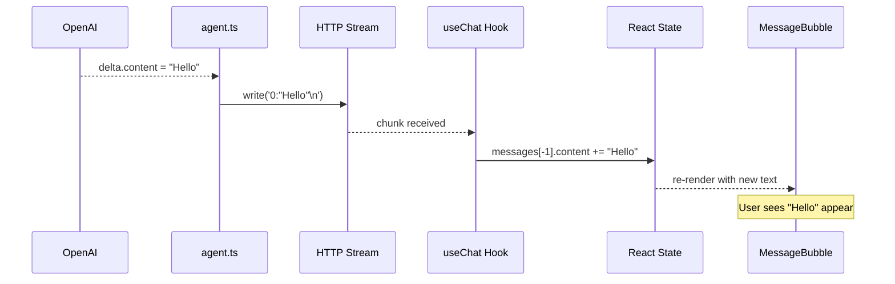

# Module 04 — Streaming Protocol

← [Tools & Skills](./03-tools-and-skills.md) | Next: [Memory & Agents →](./05-memory.md)

---

## Learning Objectives

After reading this module you will be able to:
- Explain why streaming is used instead of waiting for a complete response
- Read and interpret every event type in the Vercel AI SDK data-stream wire format
- Trace the path a single token takes from OpenAI → HTTP response → React state → DOM
- Understand how tool calls, tool results, and reasoning tokens are transported
- Describe how `useChat` and `createDataStreamResponse` interact

---

## Why Streaming?

Without streaming, the full HTTP response body would not begin transmitting until the LLM finished generating — which can take 10–60 seconds for long responses. The user would see a blank chat for the entire duration.

Streaming sends each token to the browser as it is produced, giving the user:
- Instant feedback ("the model is working")
- A natural "typing" effect
- Partial tool call arguments visible before they're complete
- Incremental display of reasoning ("Thinking…" panel)

**What makes this harder than a regular response:** The server and client must agree on an encoding that can carry multiple event types (text, tool calls, tool results, errors) in a single HTTP response, and the client must be able to parse the stream incrementally without waiting for the full body.

AgentPrimer uses the **Vercel AI SDK data-stream protocol** — a line-delimited text format that encodes each event as `<type_code>:<json_value>\n`.

---

## Wire Format

The HTTP response has:
- `Content-Type: text/plain; charset=utf-8`
- `Transfer-Encoding: chunked` (HTTP/1.1) or HTTP/2 streaming

Each line is a self-contained event:
```
<type_code>:<json_value>\n
```

HTTP chunks are **not** aligned to lines — a single chunk may contain multiple events, or a single event may be split across two chunks. The client reassembles lines before parsing.

### Event Type Reference

| Code | Name | Payload | When emitted |
|------|------|---------|-------------|
| `f` | `start_step` | `{ messageId: string }` | Start of each agent step |
| `g` | `reasoning` | `"chain of thought text"` | Each reasoning token (thinking models) |
| `0` | `text` | `"token text"` | Each assistant text token |
| `b` | `tool_call_streaming_start` | `{ toolCallId, toolName }` | First chunk of a tool call |
| `c` | `tool_call_delta` | `{ toolCallId, argsTextDelta }` | Each argument fragment |
| `9` | `tool_call` | `{ toolCallId, toolName, args }` | Complete tool call (after all args received) |
| `a` | `tool_result` | `{ toolCallId, result }` | After tool executes |
| `e` | `finish_step` | `{ finishReason, usage, isContinued }` | End of each agent step |
| `d` | `finish_message` | `{ finishReason, usage }` | Stream fully complete |
| `3` | `error` | `"error message string"` | On unhandled server error |

### Example Stream

Here is the raw byte stream for an agent turn that reads a file and then answers:

```
f:{"messageId":"msg-abc123"}
b:{"toolCallId":"tc-0","toolName":"read_file"}
c:{"toolCallId":"tc-0","argsTextDelta":"{\"path\""}
c:{"toolCallId":"tc-0","argsTextDelta":":\"/app.ts\"}"}
9:{"toolCallId":"tc-0","toolName":"read_file","args":{"path":"/app.ts"}}
a:{"toolCallId":"tc-0","result":"import React from 'react';\n..."}
e:{"finishReason":"tool_calls","usage":{"promptTokens":0,"completionTokens":0},"isContinued":true}
f:{"messageId":"msg-abc123"}
0:"Based on the file, the component "
0:"imports React and "
0:"exports a default function."
e:{"finishReason":"stop","usage":{"promptTokens":0,"completionTokens":0},"isContinued":false}
d:{"finishReason":"stop","usage":{"promptTokens":0,"completionTokens":0}}
```

---

## Server Side: How It's Produced

### `createDataStreamResponse` (Vercel AI SDK)

`lib/agent.ts` calls `createDataStreamResponse` which:
1. Creates an HTTP `Response` with the correct headers
2. Creates a `TransformStream` that `DataStreamWriter` writes to
3. Calls the `execute(writer)` callback immediately
4. Returns the Response so Next.js can begin sending bytes

```typescript
return createDataStreamResponse({
  execute: async (writer: DataStreamWriter) => {
    // Emitted at the start of each step:
    writer.write(formatDataStreamPart('start_step', { messageId }));

    // Every text token from OpenAI → forwarded immediately:
    writer.write(formatDataStreamPart('text', delta.content));

    // Every reasoning token (DeepSeek R1, o1, etc.):
    writer.write(formatDataStreamPart('reasoning', delta.reasoning_content));

    // Tool call stream:
    writer.write(formatDataStreamPart('tool_call_streaming_start', { toolCallId, toolName }));
    writer.write(formatDataStreamPart('tool_call_delta', { toolCallId, argsTextDelta }));
    writer.write(formatDataStreamPart('tool_call', { toolCallId, toolName, args }));
    writer.write(formatDataStreamPart('tool_result', { toolCallId, result }));

    // At the end:
    writer.write(formatDataStreamPart('finish_message', { finishReason: 'stop', ... }));
  },
  onError: (err) => String(err), // Error → in-stream error message
});
```

---

## Client Side: How `useChat` Consumes It

The `useChat` hook from the Vercel AI SDK (`ai/react`) handles the stream automatically. It:

1. Sends `POST /api/chat` with the current messages
2. Reads the chunked response line by line
3. Dispatches each event to the appropriate state update:

| Event | `useChat` action |
|-------|-----------------|
| `text` | Append to `messages[-1].content` |
| `reasoning` | Append to `messages[-1].reasoning` (hidden metadata) |
| `tool_call_streaming_start` | Add `toolInvocation` with `state: "partial-call"` |
| `tool_call_delta` | Append args text to the partial tool invocation |
| `tool_call` | Update tool invocation to `state: "call"` with full args |
| `tool_result` | Update tool invocation to `state: "result"` |
| `finish_message` | Mark message as complete, enable the input |

The messages are stored in `useChat`'s React state. `MessageBubble` renders them.

---

## Sequence: Token Arrival to Browser Render



---

## Reasoning Tokens (Thinking Models)

Models like DeepSeek R1 emit a `reasoning_content` field alongside `content`. The agent forwards these as `g:` (reasoning) parts:

```
g:"Let me think about this problem step by step..."
g:"First, I need to understand what the user wants..."
0:"The answer is 42."
```

`useChat` accumulates reasoning text separately. `MessageBubble` renders it in a collapsible "Thinking…" panel styled with a different color than the main response.

The reasoning text is also **persisted** between turns via the reasoning cache (`lib/agent.ts`) so the model can continue its chain of thought on the next turn.

---

## Error Handling

If an exception is thrown inside the `execute` callback, the `onError` handler converts it to a string and emits it as a `3:` (error) part. The browser sees a partial response ending with an error message rather than a broken stream that never completes.

The `useChat` hook surfaces this as an `error` object in its return value, which the UI can display.

---

## Alternate Approaches

| Approach | Trade-off |
|----------|-----------|
| **Vercel AI SDK data stream** (AgentPrimer's approach) | Battle-tested; free; handles all event types; must use compatible client (`useChat`) |
| **Server-Sent Events (raw SSE)** | Native browser support with `EventSource`; text-only unless you invent your own event types |
| **WebSocket (bidirectional)** | Allows server-to-client AND client-to-server after handshake; overkill for one-directional token streaming; more complex setup |
| **Server Actions + ReadableStream** | Next.js 14+ pattern; streaming without a custom API route; limited event typing |
| **OpenAI Realtime API** | WebSocket protocol for voice + text; purpose-built for real-time; not supported by all models |

**Why not WebSockets?** Token streaming is unidirectional (server → client). HTTP chunked transfer handles this perfectly without the added complexity of WebSocket connection management, reconnection logic, and the requirement for a stateful server.

---

## Future Expansion

1. **Resumable streams** — If the browser disconnects mid-stream (network drop, page reload), the current stream is lost. A resumable stream would allow reconnecting and picking up where it left off, keyed by message ID.

2. **Progress events for file operations** — When the agent is writing a large file, emit progress events (`bytes_written`, `total_bytes`) so the UI can show a progress bar.

3. **Partial JSON streaming** — Currently, tool call results are sent as a complete JSON string in the `a:` event. For very large results (e.g., reading a 50 KB file), sending the result in fragments would reduce time-to-first-byte for tool results.

4. **Multi-session broadcasting** — If the same agent session is open in two browser tabs, both should see the same tokens. This would require a pub/sub layer (e.g., Redis Streams or a broadcast channel) to fan out stream events.

---

## Exercises

1. **Read the raw stream:** Open the browser Network tab, find the `/api/chat` request, click on it, and look at the Response tab. You should see lines like `0:"Hello"` appearing in real time. Identify at least one `b:`, `c:`, `9:`, and `a:` event.

2. **Count events per turn:** Write a small Node.js script that reads `/api/chat` response line by line and counts how many events of each type are produced per turn. Find a turn that has tool calls and observe the `b → c → c → ... → 9 → a` sequence.

3. **Inject an error:** In `lib/agent.ts`, throw an error inside the `execute` callback before the first LLM call. Reload the app and send a message. Observe the `3:` event in the stream and how `useChat` surfaces the error.

4. **Visualize reasoning:** Enable a thinking model (DeepSeek R1 or similar), ask a complex math question, and observe the `g:` events arriving before the `0:` events. Expand the "Thinking..." panel in the UI.

---

## Further Reading

- Vercel AI SDK stream protocol: [AI SDK Data Stream](https://sdk.vercel.ai/docs/ai-sdk-ui/stream-protocol)
- HTTP chunked transfer encoding: [MDN Web Docs](https://developer.mozilla.org/en-US/docs/Web/HTTP/Headers/Transfer-Encoding)
- Server-Sent Events: [MDN Web Docs](https://developer.mozilla.org/en-US/docs/Web/API/Server-sent_events/Using_server-sent_events)
- OpenAI streaming guide: [Streaming with the OpenAI API](https://platform.openai.com/docs/guides/streaming-responses)

See: [Module 05 — Memory & Agents →](./05-memory.md)
