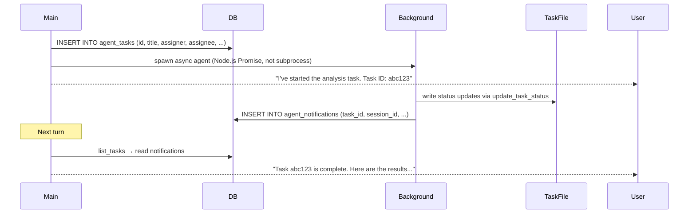

# Module 05 — Memory & Agents

← [Streaming Protocol](./04-streaming.md) | Next: [Approval Gate →](./06-approval-gate.md)

---

## Learning Objectives

After reading this module you will be able to:
- Explain how AgentPrimer stores short-term and long-term memory
- Edit `data/agents/<agent>/agent.md` to create, configure, and restrict a new agent
- Describe the model resolution priority chain
- Understand the difference between synchronous and asynchronous sub-agents
- Explain how the `agent_tasks` and `agent_notifications` tables coordinate async work

---

## Memory Architecture

AgentPrimer combines several context and persistence layers:

| Layer | Storage | Scope | Updated by |
|------|---------|-------|-----------|
| **Short-term chat state** | In-memory `messages[]` array (`useChat` state) | Current browser view | User messages + agent responses |
| **Conversation history** | SQLite `messages` table | Chat session | Chat API after each turn |
| **Global system prompt** | `data/system.md` | All agents, all sessions | Prompts & Memory page or direct edit |
| **Per-agent memory** | `data/agents/<agent>/memory.md` file | One named agent across sessions | `append_memory` / `replace_memory` tools |
| **Agent configuration** | `data/agents/<agent>/agent.md` + DB `settings` table | Specific named agent | Prompts & Memory page, Settings, or direct edit |
| **RAG knowledge** | SQLite `knowledge_*` tables | All agents via tool search | Knowledge page ingestion |

---

## `data/system.md`

`system.md` is the **global system prompt** — its content is injected at the very beginning of every agent's system prompt, before the agent's own system prompt. Think of it as the meta-instruction layer.

```markdown
# System

This system runs on AgentPrimer. You are an AI assistant helping the user accomplish tasks.
Always think step by step. Cite your reasoning. Ask clarifying questions when requirements are ambiguous.
```

**Use cases:**
- Enforce output style or language rules across all agents
- Inject environment-specific context (e.g., "This is a staging environment")
- Add safety guardrails that apply to every agent

**Editing:** Via the Prompts & Memory page or by directly editing `data/system.md`.

---

## `data/agents/<agent>/memory.md`

`data/agents/<agent>/memory.md` is free-form Markdown injected into the **system prompt** of every agent, every turn.

```markdown
# Agent Memory

## User Preferences
- Prefers TypeScript over JavaScript
- Uses pnpm, not npm

## Project Notes
- This is a Next.js 16 app with App Router
- Database file: data/db/agent.db
- API key stored in the settings table, not .env

## Recent Decisions
- Switched from middleware.ts to proxy.ts (Next.js 16 convention)
```

### Why the System Prompt (Not a Separate Message)?

The system prompt has the highest priority in the model's attention and is processed on every single turn. Injecting memory here means:
- No retrieval step — the agent always "knows" its facts
- Works even on the very first turn of a brand-new session
- Cannot be accidentally lost if the context window fills up

### Updating Memory

The agent has two built-in memory tools:

- **`append_memory`** — appends new content to the bottom of `data/agents/<agent>/memory.md`. Use when adding new facts without discarding old ones.
- **`replace_memory`** — overwrites the entire `data/agents/<agent>/memory.md`. Use only when explicitly asked to reset or restructure memory.

```mermaid
sequenceDiagram
    participant User
    participant Agent
    participant agents/<agent>/memory.md

    User->>Agent: "Remember that I prefer dark mode"
    Agent->>Agent: Decide to call append_memory
    Agent->>agents/<agent>/memory.md: append("- Prefers dark mode")
    agents/<agent>/memory.md-->>Agent: ok
    Agent->>User: "I've saved your dark mode preference."
    Note over agents/<agent>/memory.md: Next turn: preference is in system prompt
```

**Source:** `lib/memory.ts` → `readMemory()`, `writeMemory()`.

---

## `data/agents/<agent>/agent.md`

`data/agents/<agent>/agent.md` defines one named agent. Each agent lives in its own folder, for example `data/agents/main/agent.md` and `data/agents/researcher/agent.md`.

### Format

```markdown
# my-specialist
**System Prompt:** You are a specialist for a focused workflow. Explain your reasoning clearly and use tools only when useful.

**Tools:** read_file, write_file, append_memory
**Model:** default
```

Structured-output agents may also reference an inline schema or a schema file:

```markdown
# extractor
**System Prompt:** You are a data extraction agent. Extract structured information from documents.
**Output Schema File:** schemas/output.json
**Tools:** none
**Model:** default
```

### Field Reference

| Field | Required | Description |
|-------|----------|-------------|
| `# name` | Yes | Agent name (used in the UI dropdown and `run_subagent_async` calls) |
| `**System Prompt:**` | Yes | The agent's base system prompt. The composed prompt prepends `data/system.md` and appends `data/agents/<agent>/memory.md`. |
| `**Tools:**` | No | `all` for every available tool, `none` to disable tools, or a comma-separated list of specific tool/source names. Schema agents default to `none` when omitted; other agents default to `all`. |
| `**Model:**` | No | Overrides the default model. Can be overridden again by the UI model selector. |
| `**Output Schema:**` | No | Inline schema block label plus a JSON Schema fenced block. When set, the agent runs the normal ReAct loop and then makes a finalize call that converts the transcript into JSON. If `Tools:` is `none` or omitted on a schema agent, it skips the tool loop and performs only the finalize call. See [Module 10](./10-structured-output.md). |
| `**Output Schema File:**` | No | Path to a JSON Schema file relative to the agent folder, such as `schemas/output.json`. Paths are resolved under `data/agents/<agent>/` and cannot escape that directory. |

### Tool Filtering

When `**Tools:**` is a comma-separated list, the agent only receives those tools:

```markdown
**Tools:** append_memory, calculator__calculate, github__create_issue
```

- Built-in tool names: `append_memory`, `replace_memory`, `run_subagent_async`, `read_file`, `write_file`, `edit_file`, etc.
- Function tool names use the name from `function.json`
- MCP tool names use the `servername__toolname` prefix
- SKILL.md skills are not function-call tools; the built-in `load_skill` tool loads their full instructions on demand
- You can include the source name alone to allow all tools from that source when applicable

### Parsing

`lib/memory.ts` lists folders under `data/agents/`, reads each folder's `agent.md`, extracts the fields with regex, and reads the matching `memory.md`. The built-in fallback agent is `main`.

---

## Multi-Agent Patterns

### Asynchronous Sub-agent (`run_subagent_async`)

The main agent fires off a long-running task and continues. Useful for work that takes many steps (e.g., code generation, research, file processing) while the user keeps chatting.



**How async sub-agents communicate back:**

1. **Task file** — A Markdown file at `<project_folder>/tasks/<task_id>.md`. The sub-agent appends status lines with `update_task_status`:

   ```markdown
   ## Status
   - [2024-01-15 10:23:01] progress: Scanning 142 source files...
   - [2024-01-15 10:23:45] progress: Found 23 API endpoints.
   - [2024-01-15 10:24:02] finished: Analysis complete. See report below.

   ## Result
   The codebase contains 23 REST API endpoints...
   ```

2. **`agent_notifications` table** — When the sub-agent finishes (or errors), it writes a notification record to the DB. On the parent agent's next turn, the notification is included in the system prompt, prompting the agent to report back to the user.

**Source:** `lib/agent.ts` → `run_subagent_async` tool, `update_task_status` tool, `list_tasks` tool; `lib/db.ts` → `agent_tasks` and `agent_notifications` table definitions.

---

## Model Priority

When resolving which model to use for a given turn:

```
1. UI model selector (per-message override)
        ↓
2. agents/<agent>/agent.md **Model:** field for the selected agent
        ↓
3. DB settings → key: 'default_model' (set under Settings → Default Model)
        ↓
4. ⚠ If still unset: the agent loop emits a friendly streamed message
   asking the user to open the Settings page and pick a model, then
   stops. There is NO hardcoded fallback model — the project ships
   model-agnostic so it never silently uses a vendor you didn't choose.
```

The UI selector always wins, which lets you test a different model on specific messages without changing the agent configuration permanently.

In data/agents/<agent>/agent.md, the literal value `**Model:** default` is equivalent to omitting the line — both fall through to step 3 above. Use either form to defer to the global Settings page choice.

---

## Alternate Memory Approaches

| Approach | Trade-off |
|----------|-----------|
| **Markdown injection** (AgentPrimer's approach) | Dead simple; human-readable; no retrieval; full memory is always in context; won't scale beyond ~10 KB |
| **Vector / semantic memory** | Retrieve only relevant facts; scales to millions of entries; requires an embedding model + vector DB (e.g. Chroma, Pinecone) |
| **Conversation summary** | Compress old messages into a summary; balances token cost; loses details |
| **RAG (Retrieval-Augmented Generation)** | Full RAG index lookup; powerful; requires chunking, embedding, retrieval pipeline |
| **OpenAI Sessions API** | Managed memory by OpenAI; black box; works only with OpenAI models |

For a local single-user setup, markdown injection is ideal: it requires zero infrastructure and the full memory is always available. For multi-user or RAG-intensive applications, semantic memory (vector DB) is the right upgrade.

---

## Future Expansion

1. **Per-session memory** — Currently `data/agents/<agent>/memory.md` is shared by one named agent across all sessions. A separate `data/sessions/<id>/agents/<agent>/memory.md` would allow session-specific knowledge.

2. **Vector memory** — Embed memory entries with an embedding model; retrieve only the top-k relevant entries for each turn using cosine similarity. This would scale to thousands of facts without context window pressure.

3. **Memory summarization** — When `data/agents/<agent>/memory.md` grows beyond a threshold, automatically summarize old entries using the LLM and write the condensed version back.

4. **Agent capability inheritance** — Allow agents to declare `**Extends:** researcher` to inherit another agent's system prompt and tool list, then add their own overrides.

5. **Persistent agent state** — Store per-agent variables (not just free-text notes) in a structured JSON store, allowing agents to track numeric counters, task lists, and other structured data.

---

## Exercises

1. **Edit agents/<agent>/agent.md directly:** Add a new agent called `reviewer` with the system prompt "You are a code reviewer. Review code for bugs, security issues, and style problems." Set its tools to `read_file, list_directory, search_files`. Select it in the UI and ask it to review a file.

2. **Trigger memory update:** Ask the agent "Please remember that I prefer all code comments in Spanish." Verify that `data/agents/<agent>/memory.md` was updated. Open a new chat and confirm the agent remembers the preference.

3. **Trace model resolution:** In `lib/agent.ts`, add a `console.log('Resolved model:', resolvedModel)` line. Then: (a) use the UI selector, (b) clear the selection, (c) modify agents/<agent>/agent.md with a `**Model:**` line. Observe which step wins.

4. **Launch an async sub-agent:** Ask the agent to "Run a background research task: find all TypeScript files in the project that use `fetch`. Report back when done." Observe the `agent_tasks` entry in the DB and the task `.md` file.

---

## Further Reading

- RAG overview: [Retrieval-Augmented Generation paper](https://arxiv.org/abs/2005.11401)
- Vector databases: [Chroma](https://www.trychroma.com/), [Pinecone](https://www.pinecone.io/)
- OpenAI Sessions: [Sessions API docs](https://platform.openai.com/docs/guides/sessions)

See: [Module 06 — Approval Gate →](./06-approval-gate.md)
