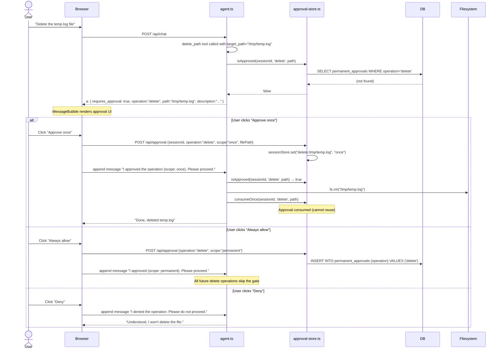
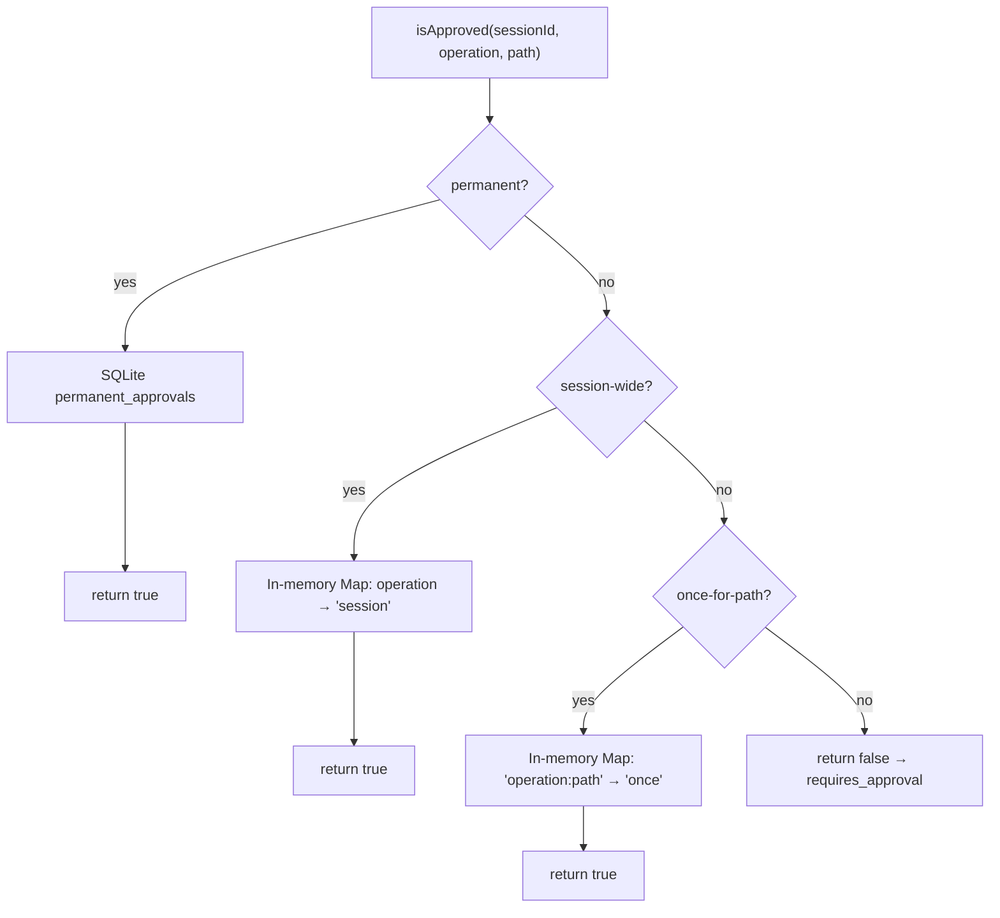

# Module 06 — Approval Gate

← [Memory & Agents](./05-memory.md) | Next: [Frontend →](./07-frontend.md)

---

## Learning Objectives

After reading this module you will be able to:
- Explain why the approval gate exists and which operations trigger it
- Trace the full approval flow from tool call to user response to operation execution
- Understand the three approval scopes (`once`, `session`, `permanent`) and when to use each
- Describe the two-tier approval store (in-memory + SQLite)
- Identify the security guarantees and limitations of this approach

---

## Why an Approval Gate?

The agent has access to built-in file system tools, including `delete_path` (which can remove files permanently) and `read_file` (which can access sensitive dotfiles like `.env`). Without any safeguard, the agent could act on an ambiguous or mistaken instruction and destroy data.

The approval gate **pauses the agent** before a sensitive operation and asks the user to confirm. The user can approve once, for the whole session, or permanently — or deny the operation entirely.

---

## Gated Operations

| Operation key | Triggered by | When |
|--------------|--------------|------|
| `delete` | `delete_path` tool | Always, for any path when a `sessionId` is available |
| `read_dotfile` | `read_file` tool | When the target filename starts with `.` (e.g. `.env`, `.gitconfig`) and a `sessionId` is available |
| `run_shell` | `run_shell` tool | Always, for any command when a `sessionId` is available |

---

## Approval Scopes

| Scope | Stored where | Duration | Behavior |
|-------|-------------|----------|----------|
| `once` | In-memory Map | This one operation | Consumed immediately after the operation runs |
| `session` | In-memory Map | Until server restarts | Covers all operations of this type for this session |
| `permanent` | SQLite `permanent_approvals` table | Forever | Survives server restarts; must be manually revoked |

---

## Full Sequence Diagram



---

## How the Gate Works in Code

### 1. `delete_path` tool checks approval before acting

```typescript
// Inside createBuiltinTools() in lib/agent.ts
delete_path: tool({
  description: '...',
  parameters: z.object({ target_path: z.string() }),
  execute: async ({ target_path: targetPath }) => {
    if (sessionId) {
      if (!isApproved(sessionId, 'delete', targetPath)) {
        // Return special object — NOT an error, the tool "succeeds" with this value
        return {
          requires_approval: true,
          operation: 'delete',
          path: targetPath,
          description: `Are you sure you want to permanently delete: ${targetPath}?`,
        };
      }
      // Consume 'once' approval immediately after checking
      consumeOnce(sessionId, 'delete', targetPath);
    }
    // Actually perform the deletion
    await fs.rm(absolutePath, { recursive: true, force: true });
    return { success: true };
  },
}),
```

### 2. `approval-store.ts` tracks state

```typescript
// Two-tier approval check
export function isApproved(sessionId, operation, filePath?) {
  // Tier 1: permanent (SQLite)
  if (isPermanentlyApproved(operation)) return true;
  
  // Tier 2: session (in-memory Map)
  const session = sessionStore.get(sessionId);
  if (session?.has(operation)) return true;           // session-wide
  if (filePath && session?.has(`${operation}:${filePath}`)) return true; // once
  
  return false;
}
```

### 3. `MessageBubble` renders the approval UI

When a tool result has `requires_approval: true`, the `LiveToolCard` component renders:

```
┌─────────────────────────────────────────────────────┐
│ ⚠️  Approval Required                               │
│ delete: /tmp/temp.log                                │
│ Are you sure you want to permanently delete this?    │
│                                                      │
│ [Approve once] [Allow this session] [Always allow]   │
│ [Deny]                                               │
└─────────────────────────────────────────────────────┘
```

### 4. `page.tsx` wires the callbacks

```typescript
<MessageBubble
  sessionId={sessionId}
  onApprovalGranted={async (_inv, scope) => {
    await append({
      role: 'user',
      content: `I approved the operation (scope: ${scope}). Please proceed.`,
    });
  }}
  onApprovalDenied={async () => {
    await append({
      role: 'user',
      content: 'I denied the operation. Please do not proceed with it.',
    });
  }}
/>
```

The approval result is communicated back to the agent as a **plain user message**, not a special API call. This means the agent can read the approval/denial message, retry the tool call (which will now pass the gate), or acknowledge the denial gracefully.

---

## `lib/approval-store.ts` Architecture



---

## API Endpoints

| Method | Path | Description |
|--------|------|-------------|
| `POST` | `/api/approval` | Grant an approval (`{ sessionId, operation, scope, filePath? }`) |
| `GET` | `/api/approval` | List all permanent approvals |
| `DELETE` | `/api/approval?operation=X` | Revoke a permanent approval |

---

## Security Notes

- Approval state is **per-session** in-memory — a new browser tab has a new sessionId and starts with no approvals
- Permanent approvals are stored per **operation type** (e.g. `delete` covers ALL future delete operations, not just specific paths)
- Background sub-agents run without a browser `sessionId`; dangerous built-ins that require UI approval, such as `delete_path` and `run_shell`, refuse to execute in that context. Still keep sub-agent `Tools:` allowlists narrow so they only receive the capabilities they need.
- The UI Deny button does NOT call the API — it only appends a denial message; no approval is ever granted

---

## Security Notes

1. **The gate only applies when a `sessionId` is available.** Main chat turns include a session and can pause for approval. Background sub-agents currently run without that browser session context, so dangerous tools that require approval refuse to execute there; restrict all other sub-agent `Tools:` allowlists to the minimum needed capabilities.

2. **`run_shell` also gates all commands in session-backed chat turns.** Even when `run_shell` is enabled in Settings, it requires approval per-command unless permanently approved.

3. **Permanent approvals are per operation type, not per path.** Approving `delete`, `read_dotfile`, or `run_shell` permanently covers all future operations of that type. Grant permanent approvals cautiously.

4. **The Deny button does NOT call the approval API.** It only appends a denial message to the conversation. No approval record is ever created. This is intentional: denying should leave no trace that could be exploited.

5. **Session approvals are lost on server restart.** In-memory Map-based session approvals disappear when the Next.js server restarts. Only permanent (SQLite) approvals survive restarts.

---

## Alternate Approaches

| Approach | Trade-off |
|----------|-----------|
| **Approval gate on return value** (AgentPrimer) | Tool "succeeds" with a special object; agent loop detects it; no exception path; clear semantics |
| **Exception-based gate** | Throw a special error; agent loop catches and pauses; harder to distinguish from real errors |
| **Middleware interception** | Intercept all tool calls at a higher level; decouples approval logic from tool code; more complex |
| **Pre-flight check** | Check approval BEFORE calling the tool, not inside it; simpler tool code; requires a wrapper layer |
| **No gate (trust model)** | Simpler; appropriate for sandboxed or read-only agents; dangerous for agents with write access |

---

## Future Expansion

1. **Path-level permanent approvals** — Currently permanent approvals cover a whole operation type (e.g., all deletes). Adding path-pattern matching (e.g., "always allow deletes under `/tmp/`") would give finer-grained control.

2. **Approval history log** — Record each approval grant/denial in the DB with timestamp, operation, and scope. This creates an audit trail for review.

3. **Time-bounded approvals** — Allow approvals that expire after N minutes or N uses, rather than the current binary once/permanent distinction.

4. **Role-based approval bypass** — If multi-user auth is added, admin users could bypass certain approval gates while regular users cannot.

5. **LLM pre-flight risk assessment** — Before triggering the approval UI, call a small/fast LLM to assess the risk level of the proposed operation and display a risk score to the user alongside the approval buttons.

---

## Exercises

1. **Trigger the approval gate:** Ask the agent to delete a file (e.g., "Please delete data/tmp/test.txt" — create it first with `write_file`). Observe the approval UI appearing. Click "Approve once" and confirm the file is deleted.

2. **Grant a session approval:** Approve a `delete` at session scope. Then ask the agent to delete a second file. Confirm that no approval prompt appears for the second deletion.

3. **Inspect permanent approvals:** Grant a permanent approval, then open the SQLite DB (`sqlite3 data/db/agent.db`) and run `SELECT * FROM permanent_approvals;`. Revoke it from the Approvals page and verify it is removed.

4. **Review sub-agent safety:** Create a restricted agent with a narrow `Tools:` allowlist, then launch it with `run_subagent_async` and verify it only receives the intended tools.

---

## Further Reading

- OWASP: [Prompt injection attacks](https://owasp.org/www-project-top-10-for-large-language-model-applications/)
- Human-in-the-loop patterns: [OpenAI Agents SDK — Human in the loop](https://openai.github.io/openai-agents-python/human_in_the_loop/)

See: [Module 07 — Frontend →](./07-frontend.md)
