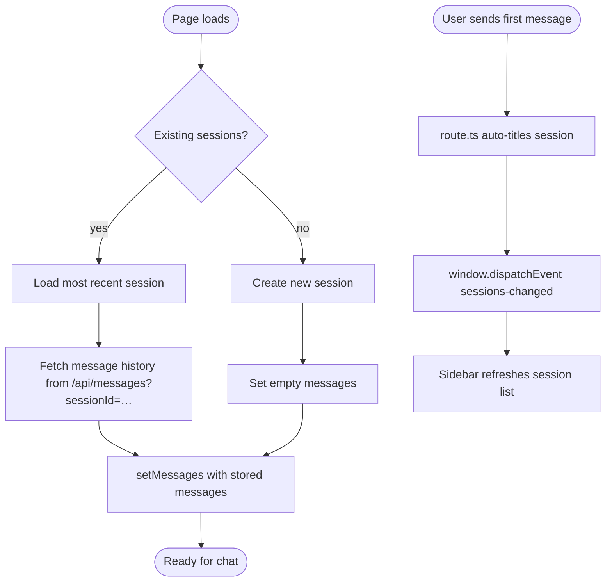

# Module 07 — Frontend

← [Approval Gate](./06-approval-gate.md) | Next: [Database →](./08-database.md)

---

## Learning Objectives

After reading this module you will be able to:
- Navigate the full component tree of the chat UI
- Explain how `useChat` connects the browser to the streaming API route
- Trace the path from user input to screen-rendered response
- Describe the purpose of each major component
- Understand how file attachments, the Preview Panel, and agent-delivered files work
- Explain the difference between rendering a live streaming message vs a historical message

---

## Component Tree

```mermaid
graph TD
    ChatInterface["components/ChatInterface.tsx\n(shared chat client component)"]
    Sidebar["components/Sidebar.tsx\n(session list + session action menu)"]
    ResizableSidebar["components/ResizableSidebar.tsx\n(draggable sidebar width)"]
    MessageBubble["components/MessageBubble.tsx\n(thin orchestrator)"]
    MessageSubs["components/message/*\n(ToolCards · Reasoning · FileBlocks · StructuredOutput · FinalizeCallBubble · TraceDrawer)"]
    ChatInput["components/ChatInput.tsx\n(text + file input)"]
    ChatSubs["components/chat/*\n(chat-screen sub-components)"]
    ModelSelector["components/ModelSelector.tsx\n(provider model selector)"]
    PreviewPanel["components/PreviewPanel.tsx\n(live preview panel)"]
    ThemeToggle["components/ThemeToggle.tsx\n(light/dark mode)"]
    RagViewerPanel["components/RagViewerPanel.tsx\n(RAG document preview panel)"]
    SendToRagDialog["components/SendToRagDialog.tsx\n(send message to RAG)"]
    WritingGuideModal["components/WritingGuideModal.tsx\n(agent.md/memory.md writing guide)"]
    SystemPromptModal["components/SystemPromptModal.tsx\n(inspect composed system prompt)"]
    AuthGuard["components/AuthGuard.tsx\n(client-side auth boundary)"]
    BrandLogo["components/BrandLogo.tsx"]
    CodeEditorPanel["components/CodeEditorPanel.tsx\n(Monaco wrapper)"]
    MermaidBlock["components/MermaidBlock.tsx\n(Mermaid diagrams)"]
    MarkdownContent["components/MarkdownContent.tsx\n(GFM + KaTeX + syntax highlighting)"]
    EditorSubs["components/editor/*\n(Agent Files editor pieces)"]
    LearnSubs["components/learn/*\n(Learn page pieces)"]
    UI["components/ui/*\n(small shared primitives)"]
    TokenGauges["Token gauges (inside ChatInterface)\n(context + output usage bars)"]

    ChatInterface --> ResizableSidebar
    ResizableSidebar --> Sidebar
    ChatInterface --> ModelSelector
    ChatInterface --> ThemeToggle
    ChatInterface --> MessageBubble
    MessageBubble --> MessageSubs
    ChatInterface --> PreviewPanel
    ChatInterface --> RagViewerPanel
    ChatInterface --> ChatInput
    ChatInterface --> ChatSubs
    ChatInterface --> TokenGauges
    MessageBubble --> MarkdownContent
    MarkdownContent --> MermaidBlock
```



---

## `components/ChatInterface.tsx`

The shared chat client component used by both `app/(main)/chat/page.tsx` (new conversation) and `app/(main)/chat/[id]/page.tsx` (existing session). Owns all shared state and wires everything together.

### Key State

| State | Type | Purpose |
|-------|------|---------|
| `sessionId` | `string` | Current chat session UUID |
| `agentName` | `string` | Selected agent (from data/agents/<agent>/agent.md) |
| `modelId` | `string` | Selected model (overrides agent default) |
| `messages` | `Message[]` | Managed by `useChat` |
| `isLoading` | `boolean` | True while the stream is active |
| `pendingAttachments` | `Attachment[]` | Files staged for the next send |

### `useChat` Configuration

```typescript
const { messages, append, isLoading, setMessages } = useChat({
  api: '/api/chat',
  // Extra data sent alongside every request body
  body: { sessionId, agentName, modelId: modelId || undefined },
  onFinish: () => {
    // Refresh session list in sidebar (title may have been set by the first message)
    window.dispatchEvent(new Event('sessions-changed'));
  },
  onError: (error) => {
    // Handle stream errors (e.g., API timeout, auth failure)
    console.error('Chat stream error:', error);
  },
});
```

Every time the user sends a message, `useChat` sends `POST /api/chat` with `{ messages, sessionId, agentName, modelId }` and starts reading the streaming response.

### Sending a Message

```typescript
// components/ChatInterface.tsx — attachments are passed in the per-call
// `body` override on `append`, NOT as a message annotation.
const handleSend = async (text: string, attachments: Attachment[]) => {
  await append(
    { role: 'user', content: text },
    { body: { sessionId, agentName, modelId, attachments } },
  );
};
```

### Token Gauges

`ChatInterface` displays two token usage progress bars below the chat header:
- **Context length** — estimated prompt tokens vs. model's known context window
- **Output length** — estimated completion tokens vs. model's known max output limit

Limits come primarily from the provider's `/v1/models` endpoint (`context_length` / `max_output_tokens`). When the provider does not advertise them, AgentPrimer falls back to a small lookup of well-known prefixes in `lib/model-lengths.ts` (`KNOWN_CONTEXT_LENGTHS` and `KNOWN_OUTPUT_LENGTHS`), each an array of `[modelPrefix, size]` pairs matched by `startsWith`.

### Approval Gate Callbacks

```typescript
<MessageBubble
  sessionId={sessionId}
  onApprovalGranted={async (inv, scope) => {
    await append({
      role: 'user',
      content: `I approved the operation (scope: ${scope}). Please proceed.`,
    });
  }}
  onApprovalDenied={async (inv) => {
    await append({
      role: 'user',
      content: 'I denied the operation. Please do not proceed with it.',
    });
  }}
/>
```

The approval result is sent as a regular user message. The agent loop then retries the tool call (which now passes the gate) or acknowledges the denial.

### Session Lifecycle



---

## `components/MessageBubble.tsx`

`MessageBubble` is a thin orchestrator that delegates rendering to specialised sub-components under `components/message/`:
- `ToolCards.tsx` — live and historical tool-call cards (including approval UI)
- `Reasoning.tsx` — collapsible "Thinking…" panel
- `FileBlocks.tsx` — inline previews for `send_file` results
- `StructuredOutput.tsx` — structured-output renderers (see Module 10)
- `FinalizeCallBubble.tsx` — finalize call bubble
- `TraceDrawer.tsx` — per-step trace inspector

It handles three rendering modes:

| Mode | When | Source |
|------|------|--------|
| **Streaming** | `isStreaming: true` | `parts` and `toolInvocations` from the live useChat message |
| **Historical** | Loaded from DB | `parts`/`toolCalls` from `parts_json` / `tool_calls_json` |
| **User message** | `role: "user"` | Plain markdown content |

### Props

```typescript
interface MessageBubbleProps {
  role: 'user' | 'assistant' | 'tool' | 'system';
  content: string;
  attachments?: Attachment[];
  toolCalls?: ToolCall[];             // Historical (from DB)
  toolInvocations?: LiveToolInvocation[]; // Live (streaming)
  parts?: UIPart[];                   // Ordered parts (text, reasoning, tool-invocation)
  reasoning?: string;                 // Chain-of-thought text (fallback when no parts)
  isStreaming?: boolean;
  expandByDefault?: boolean;
  sessionId?: string;
  onApprovalGranted?: (inv: LiveToolInvocation, scope: 'once' | 'session' | 'permanent') => void;
  onApprovalDenied?: (inv: LiveToolInvocation) => void;
}
```

### Reasoning Panel

When `reasoning` is non-empty (from thinking models like DeepSeek R1), a collapsible panel appears above the message text:

```
▶ Thinking...
  └─ [expandable text: "Let me analyze this step by step..."]
```

### Tool Invocation States

Each tool invocation goes through states as the stream progresses:

| State | Visual |
|-------|--------|
| `partial-call` | "Calling tool_name…" with spinning loader |
| `call` | Tool name + formatted args JSON |
| `result` | Tool name + args + result (or approval UI) |

### Approval UI (`LiveToolCard`)

When `inv.result.requires_approval === true`, an approval panel replaces the normal result display:

```
┌──────────────────────────────────────────────────────────┐
│ 🛡️ delete  /path/to/file.txt                             │
│ Are you sure you want to permanently delete this?        │
│                                                          │
│ [Approve once] [Allow this session] [Always allow]       │
│ [Deny]                                                   │
└──────────────────────────────────────────────────────────┘
```

The buttons call `POST /api/approval` (for approve) or directly call `onApprovalDenied` (for deny).

---

## `components/ChatInput.tsx`

Multi-line text area with file attachment support.

### Keyboard Shortcuts

| Key | Action |
|-----|--------|
| `Enter` | Send message |
| `Shift+Enter` | Insert newline |

### Focus Management

The textarea gets `disabled` when `isLoading` is true. The browser automatically removes focus from disabled elements, which would force the user to click the input area after every message.

Fix: a `useEffect` watches `disabled` and re-focuses when `isLoading` transitions back to `false`:

```typescript
useEffect(() => {
  if (!disabled) {
    textareaRef.current?.focus();
  }
}, [disabled]);
```

Additionally, `handleSend()` calls `.focus()` after clearing the text, and the `<textarea>` has `autoFocus` for initial page load.

### File Attachment Flow

```mermaid
sequenceDiagram
    participant User
    participant ChatInput
    participant UploadAPI

    User->>ChatInput: Click paperclip icon
    ChatInput->>ChatInput: Open hidden <input type="file">
    User->>ChatInput: Select files
    ChatInput->>UploadAPI: POST /api/upload (FormData)
    UploadAPI-->>ChatInput: { name, url, mime, size }
    ChatInput->>ChatInput: Add to pendingAttachments state
    Note over ChatInput: Thumbnail/icon shown in input area
    User->>ChatInput: Send message
    ChatInput->>ChatInterface: onSend(text, attachments)
    ChatInterface->>useChat: append({ role:"user", content:text }, { body:{ attachments, ... } })
```



Files are uploaded immediately when selected (not at send time). The returned URL is a local `/api/uploads/<filename>` path stored in `data/uploads/`.

---

## `useChat` Data Flow

```mermaid
flowchart LR
    subgraph Browser
        Input["ChatInput\nonSend()"]
        Hook["useChat hook\n(message state)"]
        Bubble["MessageBubble\n(renders)"]
    end
    subgraph Server
        Route["app/api/chat/route.ts\nPOST /api/chat"]
        Agent["lib/agent/streaming-agent.ts\n+ lib/agent/loop.ts"]
    end

    Input -->|append()| Hook
    Hook -->|POST body| Route
    Route --> Agent
    Agent -->|AI SDK data stream chunks| Hook
    Hook -->|messages[] update| Bubble
```

The `useChat` hook handles:
- Sending the POST request
- Reading the AI SDK data stream chunk by chunk
- Updating `messages[]` in React state on each chunk
- Setting `isLoading` true/false
- Exposing `error` if the stream errors

`MessageBubble` is a pure rendering component — it receives props from `ChatInterface`, which reads `messages` from `useChat`.

---

## Rendering Historical Messages

Messages loaded from the database are formatted slightly differently than live streaming messages:

| Field | Live (streaming) | Historical (DB) |
|-------|-----------------|-----------------|
| Tool calls | `msg.toolInvocations` / ordered `msg.parts` of type `tool-invocation` | `msg.toolCalls` (parsed from `tool_calls_json`) and `msg.parts` (parsed from `parts_json`) |
| Reasoning | `msg.parts` entries of type `reasoning` (preferred); accumulated on `msg.reasoning` as a fallback | Restored from persisted `reasoning_json` and `parts_json` |
| Content | Built up chunk by chunk | Full string from DB |

When `ChatInterface` loads a session's history it calls `setMessages()` to inject the stored messages into the `useChat` hook's state, keeping the same rendering pipeline.

---

## New Components

### `components/PreviewPanel.tsx`

The Preview Panel is a resizable right-side panel that displays files generated by the agent. It stays open between messages and can be toggled via a button in the chat header.

**Supported file types:**
- **HTML** — rendered in a sandboxed `<iframe>` with scripts allowed, same-origin disabled, and preview CSP applied
- **Images** (PNG, JPEG, GIF, WebP, SVG) — displayed with zoom controls
- **PDFs** — rendered using the browser's native PDF viewer
- **Markdown** — split view (Monaco editor + live rendered preview) so both agent and user can edit collaboratively

**How it opens:** The `open_preview` built-in tool returns `{ type: 'open_preview', path, title, exists }`. `ChatInterface` watches tool results for this shape, converts the path to a workspace or editor preview URL, and opens the panel.

**Source:** `components/PreviewPanel.tsx`

### Session Action Menu (`Sidebar.tsx`)

Each session in the sidebar has a **More** button (horizontal ellipsis) that opens a context menu:
- **Pin Chat** / **Unpin Chat** — pins the session to the top of the sidebar; persisted via `pinSessionChat()` in SQLite
- **Pin Prompt** / **Unpin Prompt** — pins the first user message as a clickable prompt for quick reuse
- **Rename** — inline rename of the session title
- **Delete** — removes the session and all its messages (cascading delete)

Pinned sessions are displayed in a separate collapsible "Pinned Chats" section above the recent session list.

### `components/WritingGuideModal.tsx`

An educational modal triggered from the Agents page that explains how to write `system.md`, `agent.md`, and `memory.md`. Each tab contains field reference tables, format rules, and examples. Useful for new users learning the agent configuration format.

### `components/ModelSelector.tsx`

A searchable provider model dropdown. It fetches `/api/models`, filters as the user types, and lets the user override the selected agent's default model for the current chat.

### `components/ResizableSidebar.tsx`

A wrapper component that makes the sidebar width adjustable by dragging a handle. It persists the chosen width to `localStorage` via the `useSidebarWidth` hook so the preference survives page reloads.

**Source:** `components/ResizableSidebar.tsx`, `hooks/useSidebarWidth.ts`

### `components/ThemeToggle.tsx`

A button that toggles between light and dark mode. The current theme is stored as a `data-theme` attribute on `<html>`. The preference is persisted to `localStorage`.

**Source:** `components/ThemeToggle.tsx`

---

## Agent-Delivered Files (`send_file` rendering)

When the agent calls `send_file`, the tool result contains:

```json
{
  "agentFile": {
    "id": "4027a204-0383-4c3a-826a-284a6833857f",
    "filename": "report.pdf",
    "mime_type": "application/pdf",
    "size": 142000,
    "url": "/api/files/4027a204.../report.pdf",
    "label": "Q4 Report"
  }
}
```

`MessageBubble` detects this shape in the `tool_result` part and renders an **AgentFile card**:

```
┌─────────────────────────────────────────────────┐
│ 📄 Q4 Report                          [Download] │
│ report.pdf • 138 KB                             │
│ ─────────────────────────────────────────────── │
│ [inline PDF viewer / image preview / audio play]│
└─────────────────────────────────────────────────┘
```

The file is served by `app/api/files/[id]/route.ts` with the correct `Content-Type` header, enabling the browser's native media player, PDF viewer, or image display.

---

## Additional Pages

Beyond the main chat page, the app has several utility pages:

| Route | Component | Purpose |
|-------|-----------|---------|
| `/` | `app/page.tsx` | Landing page / redirect |
| `/chat` | `app/(main)/chat/page.tsx` | Main chat interface |
| `/chat/[id]` | `app/(main)/chat/[id]/page.tsx` | Direct link to a saved chat session |
| `/agents` | `app/(main)/agents/page.tsx` | Agent management (create, edit, view agents/<agent>/agent.md) |
| `/approvals` | `app/(main)/approvals/page.tsx` | View and revoke permanent approvals |
| `/settings` | `app/(main)/settings/page.tsx` | API endpoint, embedding provider, chat behavior (token display, tracing), sub-agent monitor options, Langfuse observability, New Chat Layout (pinned chats/prompts/section order), theme, context keep pairs, tool enable/disable, data reset |
| `/statistics` | `app/(main)/statistics/page.tsx` | Token usage charts, turn counts |
| `/skills` | `app/(main)/skills/page.tsx` | Install/uninstall/manage skills, function tools, and MCP servers |
| `/tools` | `app/(main)/tools/page.tsx` | Tool Playground |
| `/knowledge` | `app/(main)/knowledge/page.tsx` | RAG ingestion and search |
| `/editor` | `app/(main)/editor/page.tsx` | Agent Files Monaco editor |
| `/learn` | `app/(main)/learn/page.tsx` | In-app curriculum dashboard |
| `/learn/[slug]` | `app/(main)/learn/[slug]/page.tsx` | In-app lesson player |
| `/login` | `app/login/page.tsx` | Authentication login form |
| `/register` | `app/register/page.tsx` | First-user registration |
| `/setup` | `app/setup/page.tsx` | Initial setup wizard |

---

## Alternate Approaches

| Area | AgentPrimer approach | Alternative |
|------|-------------------|-------------|
| **State management** | `useChat` hook (Vercel AI SDK) | Redux, Zustand, React Context |
| **Streaming consumption** | `useChat` handles SSE parsing | Manual `ReadableStream` + `TextDecoder` |
| **Styling** | Tailwind CSS utility classes | CSS Modules, styled-components |
| **Component library** | Custom components in `components/ui/` | shadcn/ui, Radix UI, Material UI |
| **Theme** | `data-theme` attribute on `<html>` | CSS `prefers-color-scheme` media query |
| **File preview** | Native browser `<iframe>` / `` | React-PDF, custom renderers |

---

## Future Expansion

1. **Real-time multi-user chat** — Multiple users sharing a session. Each browser would subscribe to a stream of events for the session. Requires server-side pub/sub (WebSockets or SSE with Redis).

2. **Message editing** — Allow users to edit a previous message and re-generate the response from that point. Requires truncating the message history in the DB.

3. **Branching conversations** — Allow the user to fork the conversation at any point, trying a different prompt without losing the original path.

4. **Voice input** — Integrate the Web Speech API (`SpeechRecognition`) for voice-to-text input in `ChatInput`.

5. **Keyboard navigation** — Full keyboard accessibility for the approval UI, model selector, and sidebar.

---

## Exercises

1. **Trace a keystroke to DOM:** Add a `console.log` in `ChatInput.handleSend()`. Send a message and trace: `handleSend` → `append` → `useChat` POST → stream → `MessageBubble` render. Count the number of re-renders using React DevTools.

2. **Add a new setting to the sidebar:** Add a button to the sidebar that resets the conversation. It should call `setMessages([])` and create a new session.

3. **Test the Preview Panel:** Ask the agent to write a simple HTML game (e.g., "Write a simple bouncing ball animation in HTML"). Observe the `open_preview` tool call, the Preview Panel opening, and the animation playing in the iframe.

4. **Inspect file delivery:** Ask the agent to send a file (e.g., "Please send me a simple SVG image of a circle"). Observe the `send_file` tool result in the Network tab. Click the download button and confirm the file is saved.

---

## Further Reading

- Vercel AI SDK `useChat`: [useChat reference](https://sdk.vercel.ai/docs/reference/ai-sdk-ui/use-chat)
- React `useEffect` for streaming: [Synchronizing with Effects](https://react.dev/learn/synchronizing-with-effects)
- Tailwind CSS: [tailwindcss.com](https://tailwindcss.com/)

See: [Module 08 — Database →](./08-database.md)
