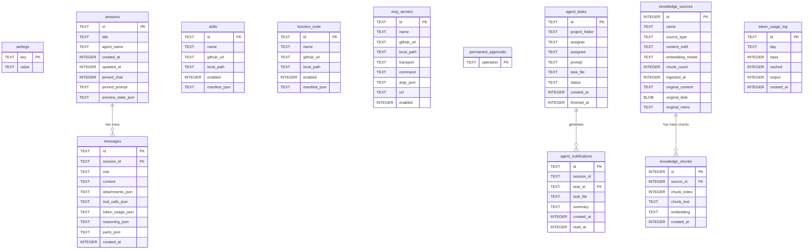
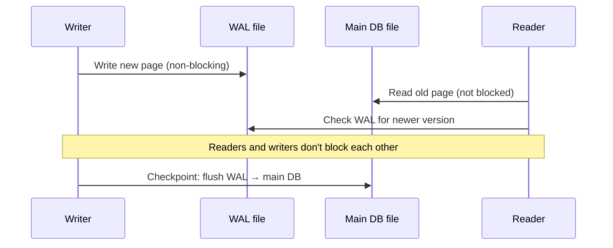

# Module 08 — Database

← [Frontend](./07-frontend.md) | [Back to README →](./README.md)

---

## Learning Objectives

After reading this module you will be able to:
- Explain why SQLite was chosen over Postgres/Redis for this use case
- Navigate every table in the schema and describe its purpose
- Understand WAL mode and why it matters for concurrent Next.js handlers
- Trace how a chat message is stored from streaming response to DB write
- Describe the migration strategy and how to add new columns safely
- Understand how `agent_tasks` and `agent_notifications` coordinate async sub-agents

---

## Overview

All persistent state lives in a single SQLite database file: **`data/db/agent.db`**.

- **Engine**: `better-sqlite3` v12 — synchronous, zero-config, no external server
- **File**: `data/db/agent.db` (created automatically on first run)
- **WAL mode**: enabled for concurrent readers without blocking writers
- **Module**: [`lib/db.ts`](../lib/db.ts) — singleton connection, auto-migration

---

## Entity Relationship Diagram



---

## Table Reference

### `settings`

Key/value configuration store. Read by `lib/agent.ts` on every request to get the API key, endpoint, and default model.

| Key | Default | Description |
|-----|---------|-------------|
| `endpoint` | `""` | Base URL for OpenAI-compatible API; configured by the operator during setup |
| `api_key` | `""` | API key (blank = unauthenticated local API) |
| `default_model` | `""` (empty) | Model used when no agent/UI override. Empty until set in Settings — the agent loop emits a friendly error pointing to `/settings` when nothing is configured. |
| `embedding_provider` | `local` | `'local'` (in-process model) or `'openai'` |
| `max_agent_steps` | `100` | Max ReAct loop iterations before forced stop |
| `reasoning:<sessionId>` | — | Last `reasoning_content` for a session (thinking models) |
| `builtin_tool_enabled:<id>` | — | `'1'` or `'0'` per tool (e.g. `builtin_tool_enabled:run_shell`) |

Any additional keys can be stored and retrieved with `getSetting(key)` / `setSetting(key, value)`.

### `sessions`

One row per chat session.

| Column | Type | Description |
|--------|------|-------------|
| `id` | TEXT PK | UUID generated by the client |
| `title` | TEXT | Auto-set from the first user message (first 60 chars) |
| `agent_name` | TEXT | Agent used for this session (from data/agents/<agent>/agent.md) |
| `created_at` | INTEGER | Unix timestamp |
| `updated_at` | INTEGER | Updated on each new message (for sorting) |
| `pinned_chat` | INTEGER | `1` when pinned in the sidebar |
| `pinned_prompt` | TEXT | Optional pinned prompt text for the session |
| `preview_state_json` | TEXT | JSON `{ open, file, history, index }` — persisted Preview Panel state so it survives page reloads |

### `messages`

One row per chat message.

| Column | Type | Description |
|--------|------|-------------|
| `id` | TEXT PK | UUID |
| `session_id` | TEXT FK | References `sessions.id` (CASCADE DELETE) |
| `role` | TEXT | `'user'`, `'assistant'`, `'tool'`, or `'system'` |
| `content` | TEXT | Full message text |
| `attachments_json` | TEXT | JSON array of `{ name, url, mime, size }` |
| `tool_calls_json` | TEXT | JSON array of `{ toolName, args, result }` — the agent's tool trace |
| `token_usage_json` | TEXT | JSON `{ input, cached, output }` — token counts for this turn |
| `reasoning_json` | TEXT | Raw `reasoning_content` from the model (thinking models like DeepSeek R1) |
| `parts_json` | TEXT | AI SDK `parts[]` array serialized as JSON — used to restore structured output panels after page reload |
| `trace_json` | TEXT | Agent trace events for richer historical rendering |
| `created_at` | INTEGER | Unix timestamp |

The `tool_calls_json` column stores the complete tool call history for each assistant message. This is used to re-render historical tool calls in the `MessageBubble` component after page load.

The `parts_json` column is written by the AI SDK's `onFinish` callback. It stores structured output data in a format that the `MessageBubble` component can restore when loading chat history.

### `skills`

Installed SKILL.md skill packages (instruction modules, not callable tools).

| Column | Type | Description |
|--------|------|-------------|
| `id` | TEXT PK | UUID |
| `name` | TEXT UNIQUE | Skill name (from SKILL.md frontmatter) |
| `github_url` | TEXT | Original GitHub URL |
| `local_path` | TEXT | Absolute path to cloned directory |
| `enabled` | INTEGER | `1` = active, `0` = disabled |
| `manifest_json` | TEXT | Raw SKILL.md content as JSON string |

### `function_tools`

Installed function tool packages (callable code — `function.json` + `index.js`).

| Column | Type | Description |
|--------|------|-------------|
| `id` | TEXT PK | UUID |
| `name` | TEXT UNIQUE | Tool name (from `function.json` `name` field) |
| `github_url` | TEXT | Original GitHub URL |
| `local_path` | TEXT | Absolute path to cloned directory |
| `enabled` | INTEGER | `1` = active, `0` = disabled |
| `manifest_json` | TEXT | Full `function.json` contents as JSON string |

### `mcp_servers`

Installed MCP server configs.

| Column | Type | Description |
|--------|------|-------------|
| `id` | TEXT PK | UUID |
| `name` | TEXT UNIQUE | Server name |
| `github_url` | TEXT | Source repo |
| `local_path` | TEXT | Cloned directory (stdio) or empty (SSE) |
| `transport` | TEXT | `'stdio'` or `'sse'` |
| `command` | TEXT | Executable for stdio (e.g. `node`) |
| `args_json` | TEXT | JSON array of arguments (e.g. `["server.js"]`) |
| `url` | TEXT | Base URL for SSE transport |
| `enabled` | INTEGER | `1` = active, `0` = disabled |

### `permanent_approvals`

One row per permanently approved operation. Current operation keys are `'delete'`, `'read_dotfile'`, and `'run_shell'`.

| Column | Type | Description |
|--------|------|-------------|
| `operation` | TEXT PK | Operation key (e.g. `'delete'`, `'read_dotfile'`) |

### `agent_tasks` *(new)*

Index table for async sub-agent tasks. The full execution log lives in a Markdown task file at the path stored in `task_file`.

| Column | Type | Description |
|--------|------|-------------|
| `id` | TEXT PK | UUID |
| `project_folder` | TEXT | Working directory for the task |
| `assigner` | TEXT | Agent name that launched this task |
| `assignee` | TEXT | Agent name executing the task |
| `prompt` | TEXT | The instruction given to the sub-agent |
| `task_file` | TEXT | Absolute path to the task `.md` file |
| `status` | TEXT | `'running'` → `'finished'` / `'error'` / `'interrupted'` |
| `created_at` | INTEGER | Unix timestamp |
| `finished_at` | INTEGER | Unix timestamp (null while running) |

**`'interrupted'` status:** On server restart, `migrate()` sets all `'running'` tasks to `'interrupted'`. This signals that the sub-agent was killed mid-execution and the task file may be incomplete.

### `agent_notifications` *(new)*

Queued notifications delivered to a parent session when an async task completes. Unread notifications are injected into the system prompt on the parent's next turn.

| Column | Type | Description |
|--------|------|-------------|
| `id` | TEXT PK | UUID |
| `session_id` | TEXT | Parent session that should receive this notification |
| `task_id` | TEXT FK | References `agent_tasks.id` |
| `task_file` | TEXT | Path to the task file for the parent to read |
| `summary` | TEXT | One-line human-readable completion summary |
| `created_at` | INTEGER | Unix timestamp |
| `read_at` | INTEGER | Set when the parent has seen this notification (null = unread) |

---

### `knowledge_sources`

One row per ingested document in the RAG.

| Column | Type | Description |
|--------|------|-------------|
| `id` | INTEGER PK | Auto-increment |
| `name` | TEXT | Display name (e.g. "Q3 Roadmap.pdf") |
| `source_type` | TEXT | `'file_upload'`, `'paste'`, or `'memory'` |
| `content_md5` | TEXT | MD5 of source content — used to skip re-ingestion when unchanged |
| `embedding_model` | TEXT | Embedding model/provider used for this source |
| `chunk_count` | INTEGER | Number of chunks produced during ingestion |
| `ingested_at` | INTEGER | Unix timestamp |
| `original_content` | TEXT | Original document text for text/markdown/html sources — used by the View panel for inline rendering |
| `original_blob` | BLOB | Original binary bytes (e.g. PDFs) — used by the View panel for iframe rendering |
| `original_mime` | TEXT | MIME type of the original document (e.g. `text/markdown`, `application/pdf`) — drives how the View panel renders it |

### `knowledge_chunks`

One row per text chunk from each source. Each source is split into ~1600-char overlapping chunks.

| Column | Type | Description |
|--------|------|-------------|
| `id` | INTEGER PK | Auto-increment |
| `source_id` | INTEGER FK | References `knowledge_sources.id` (CASCADE DELETE) |
| `chunk_index` | INTEGER | Position within the source (0-based) |
| `chunk_text` | TEXT | The actual text of the chunk |
| `embedding` | TEXT | JSON float array (e.g. `"[0.023, -0.104, ...]"`) — null until embedded |
| `created_at` | INTEGER | Unix timestamp |

Cosine similarity is computed in JavaScript at retrieval time by loading all embeddings into memory. Scales to ~50k chunks without performance issues. For larger collections, replace with the `sqlite-vec` extension.

### `knowledge_fts` (FTS5 virtual table)

Full-text search index over `knowledge_chunks`. Used as a fallback when no embeddings are available (e.g., when the local embedding model can't load).

```sql
CREATE VIRTUAL TABLE IF NOT EXISTS knowledge_fts USING fts5(
  chunk_text,
  content='knowledge_chunks',
  content_rowid='id'
);
```

The FTS5 table provides keyword-based search (BM25 ranking) without requiring an embedding model. The `search_knowledge_base` tool automatically falls back to FTS5 if vector search returns no results.

### `token_usage_log`

One row per agent turn, logging token consumption for the Statistics page.

| Column | Type | Description |
|--------|------|-------------|
| `id` | TEXT PK | Assistant message ID; prevents double-counting on backfill |
| `day` | TEXT | Local calendar day (`YYYY-MM-DD`) used for chart grouping |
| `input` | INTEGER | Prompt tokens consumed |
| `cached` | INTEGER | Prompt tokens served from the model's cache (cheaper) |
| `output` | INTEGER | Completion tokens generated |
| `created_at` | INTEGER | Unix timestamp |

Aggregated by the Statistics page (`/api/statistics`) to render Recharts bar charts for 7, 30, 90, or 365-day windows. Rows are append-only and are not deleted when sessions or messages are deleted.

---

## Full Schema SQL

```sql
CREATE TABLE IF NOT EXISTS settings (
  key   TEXT PRIMARY KEY,
  value TEXT NOT NULL DEFAULT ''
);

CREATE TABLE IF NOT EXISTS sessions (
  id                 TEXT PRIMARY KEY,
  title              TEXT NOT NULL DEFAULT 'New Chat',
  agent_name         TEXT NOT NULL DEFAULT 'main',
  created_at         INTEGER NOT NULL DEFAULT (unixepoch()),
  updated_at         INTEGER NOT NULL DEFAULT (unixepoch()),
  pinned_chat        INTEGER NOT NULL DEFAULT 0,
  pinned_prompt      TEXT,
  preview_state_json TEXT NOT NULL DEFAULT '{}'
);

CREATE TABLE IF NOT EXISTS messages (
  id               TEXT PRIMARY KEY,
  session_id       TEXT NOT NULL REFERENCES sessions(id) ON DELETE CASCADE,
  role             TEXT NOT NULL CHECK(role IN ('user','assistant','tool','system')),
  content          TEXT NOT NULL DEFAULT '',
  attachments_json TEXT NOT NULL DEFAULT '[]',
  tool_calls_json  TEXT NOT NULL DEFAULT '[]',
  token_usage_json TEXT NOT NULL DEFAULT '{}',
  reasoning_json   TEXT NOT NULL DEFAULT '',
  parts_json       TEXT NOT NULL DEFAULT '[]',
  trace_json       TEXT NOT NULL DEFAULT '[]',
  created_at       INTEGER NOT NULL DEFAULT (unixepoch())
);

CREATE TABLE IF NOT EXISTS skills (
  id            TEXT PRIMARY KEY,
  name          TEXT NOT NULL UNIQUE,
  github_url    TEXT NOT NULL,
  local_path    TEXT NOT NULL,
  enabled       INTEGER NOT NULL DEFAULT 1,
  manifest_json TEXT NOT NULL DEFAULT '{}'
);

CREATE TABLE IF NOT EXISTS function_tools (
  id            TEXT PRIMARY KEY,
  name          TEXT NOT NULL UNIQUE,
  github_url    TEXT NOT NULL,
  local_path    TEXT NOT NULL,
  enabled       INTEGER NOT NULL DEFAULT 1,
  manifest_json TEXT NOT NULL DEFAULT '{}'
);

CREATE TABLE IF NOT EXISTS mcp_servers (
  id          TEXT PRIMARY KEY,
  name        TEXT NOT NULL UNIQUE,
  github_url  TEXT NOT NULL,
  local_path  TEXT NOT NULL,
  transport   TEXT NOT NULL DEFAULT 'stdio',
  command     TEXT NOT NULL DEFAULT '',
  args_json   TEXT NOT NULL DEFAULT '[]',
  url         TEXT NOT NULL DEFAULT '',
  enabled     INTEGER NOT NULL DEFAULT 1
);

CREATE TABLE IF NOT EXISTS permanent_approvals (
  operation TEXT PRIMARY KEY
);

CREATE TABLE IF NOT EXISTS knowledge_sources (
  id               INTEGER PRIMARY KEY,
  name             TEXT NOT NULL UNIQUE,
  source_type      TEXT NOT NULL DEFAULT 'file_upload',
  content_md5      TEXT,
  embedding_model  TEXT,
  chunk_count      INTEGER NOT NULL DEFAULT 0,
  ingested_at      INTEGER NOT NULL DEFAULT (unixepoch()),
  original_content TEXT,
  original_blob    BLOB,
  original_mime    TEXT
);

CREATE TABLE IF NOT EXISTS knowledge_chunks (
  id          INTEGER PRIMARY KEY,
  source_id   INTEGER NOT NULL REFERENCES knowledge_sources(id) ON DELETE CASCADE,
  chunk_index INTEGER NOT NULL,
  chunk_text  TEXT NOT NULL,
  embedding   TEXT,
  created_at  INTEGER NOT NULL DEFAULT (unixepoch())
);

CREATE VIRTUAL TABLE IF NOT EXISTS knowledge_fts USING fts5(
  chunk_text,
  content='knowledge_chunks',
  content_rowid='id'
);

-- Async sub-agent task index
CREATE TABLE IF NOT EXISTS agent_tasks (
  id             TEXT PRIMARY KEY,
  project_folder TEXT NOT NULL DEFAULT '',
  assigner       TEXT NOT NULL DEFAULT '',
  assignee       TEXT NOT NULL DEFAULT '',
  prompt         TEXT NOT NULL DEFAULT '',
  task_file      TEXT NOT NULL DEFAULT '',
  status         TEXT NOT NULL DEFAULT 'running',
  created_at     INTEGER NOT NULL DEFAULT (unixepoch()),
  finished_at    INTEGER
);

-- Notifications from async tasks back to parent sessions
CREATE TABLE IF NOT EXISTS agent_notifications (
  id         TEXT PRIMARY KEY,
  session_id TEXT NOT NULL,
  task_id    TEXT NOT NULL,
  task_file  TEXT NOT NULL DEFAULT '',
  summary    TEXT NOT NULL DEFAULT '',
  created_at INTEGER NOT NULL DEFAULT (unixepoch()),
  read_at    INTEGER
);

CREATE TABLE IF NOT EXISTS token_usage_log (
  id         TEXT PRIMARY KEY,
  day        TEXT NOT NULL,
  input      INTEGER NOT NULL DEFAULT 0,
  cached     INTEGER NOT NULL DEFAULT 0,
  output     INTEGER NOT NULL DEFAULT 0,
  created_at INTEGER NOT NULL DEFAULT (unixepoch())
);
```

---

## WAL Mode and Concurrency



**WAL (Write-Ahead Logging)** allows concurrent reads during writes. This is important because:
- The streaming agent writes to the DB in `onFinish` while the browser may still be sending the last few bytes
- The sidebar polls `/api/sessions` while a chat is in progress

**`busy_timeout = 5000`** means SQLite will retry for up to 5 seconds before throwing `SQLITE_BUSY`. This prevents race conditions during brief write conflicts.

---

## `lib/db.ts` Helper Functions

### Settings

```typescript
getSetting(key: string): string
setSetting(key: string, value: string): void
getAllSettings(): Record<string, string>
```

### Sessions

```typescript
createSession(id, title, agentName?): Session
getSession(id): Session | undefined
listSessions(): Session[]
updateSessionTitle(id, title): void
updateSessionAgent(id, agentName): void
touchSession(id): void            // updates updated_at timestamp
deleteSession(id): void           // cascades to messages
pinSessionChat(id, pinned): void  // pin/unpin in sidebar
setPinnedPrompt(id, text): void   // set pinned prompt text
updateSessionPreviewState(id, previewStateJson): void // persist Preview Panel state
getFirstUserMessage(sessionId): string | null
```

### Messages

```typescript
saveMessage(msg: Omit<Message, 'created_at'>): void
getMessages(sessionId): Message[]
```

### Skills, Function Tools & MCP Servers

```typescript
listSkills(): Skill[]
upsertSkill(skill): void
setSkillEnabled(id, enabled): void
deleteSkill(id): void

listFunctionTools(): FunctionTool[]
upsertFunctionTool(tool): void
setFunctionToolEnabled(id, enabled): void
deleteFunctionTool(id): void

listMcpServers(): McpServer[]
upsertMcpServer(server): void
setMcpServerEnabled(id, enabled): void
deleteMcpServer(id): void
```

---

## Migration Strategy

The `migrate()` function in `lib/db.ts` runs on every cold start using `CREATE TABLE IF NOT EXISTS`. This is an **additive-only** migration strategy:

- **New tables**: safe to add in any deploy — `IF NOT EXISTS` makes it idempotent
- **New columns**: require `ALTER TABLE … ADD COLUMN` executed after the `CREATE TABLE` block
- **Column removal / rename**: not supported by SQLite directly; requires `CREATE TABLE new … AS SELECT …` + rename

### Adding a Column Safely

The `token_usage_json` column was added to `messages` after the initial schema was deployed. The approach in `lib/db.ts`:

```typescript
// Check whether the column already exists (PRAGMA returns all columns)
const msgCols = (db.prepare('PRAGMA table_info(messages)').all() as {name:string}[]).map(c => c.name);
if (!msgCols.includes('token_usage_json')) {
  db.exec("ALTER TABLE messages ADD COLUMN token_usage_json TEXT NOT NULL DEFAULT '{}'");
}
```

This guard makes the migration **idempotent** — running it on an existing DB that already has the column is safe.

- No rollback support — use the single-file SQLite backup for recovery

---

## Backup and Recovery

AgentPrimer uses SQLite WAL mode, so a live database can have recent writes in `agent.db-wal`. Do **not** back up only `agent.db` with `cp` while the app is running.

Use SQLite's online backup command for live systems:

```bash
sqlite3 data/db/agent.db ".backup data/db/agent-$(date +%F-%H%M%S).bak"
```

If the app is fully stopped, you may copy `data/db/agent.db` together with any `agent.db-wal` and `agent.db-shm` sidecar files. For Docker/Dokploy deployments, mount `data/` as a persistent volume to survive container restarts.

---

## Alternate Approaches

| Approach | Trade-off |
|----------|-----------|
| **SQLite + better-sqlite3** (AgentPrimer) | Zero-config; single file backup; synchronous API fits Next.js; not suitable for horizontal scaling |
| **PostgreSQL** | Scales horizontally; rich feature set; requires a separate server process; migrations need a proper tool (Drizzle, Prisma) |
| **Drizzle ORM** | Type-safe schema definitions; auto-generates migrations; adds abstraction layer; ideal if PostgreSQL migration is planned |
| **Prisma** | Feature-rich ORM with Studio UI; heavier; slower cold-start in serverless environments |
| **Redis** | Excellent for ephemeral state (session store, pub/sub); not suitable as a primary persistent store |
| **Plain JSON files** | Extremely simple; no query language; breaks at scale; race conditions with concurrent writes |

**Migration path to PostgreSQL:** Replace `better-sqlite3` with `pg` or `drizzle-orm/postgres-js`. The SQL schema is compatible (minor adjustments: `TEXT` → `VARCHAR`, `INTEGER` → `BIGINT` for timestamps). The helper functions in `lib/db.ts` are the only layer that needs changing.

---

## Future Expansion

1. **Full-text search on messages** — Add a virtual FTS5 table (`CREATE VIRTUAL TABLE messages_fts USING fts5(content, content='messages', content_rowid='rowid')`) to enable fast keyword search across all chat history.

2. **Message pagination** — Currently `getMessages(sessionId)` returns all messages. For long sessions, implement cursor-based pagination to avoid loading thousands of messages.

3. **Token usage analytics** — The `token_usage_log` table stores per-turn input, cached, and output token counts. The Statistics page (`/statistics`) aggregates these into Recharts bar charts, selectable by time window (7/30/90/365 days).

4. **Session export** — Add a `GET /api/sessions/<id>/export` route that dumps a session to JSON or Markdown for portability.

5. **Multi-user with row-level auth** — Add a `user_id` foreign key to `sessions` and `agent_tasks`. Filter all queries by the authenticated user ID from `proxy.ts`.

---

## Exercises

1. **Inspect the live database:** Run `sqlite3 data/db/agent.db` (requires `sqlite3` CLI). Type `.tables` to list tables. Run `SELECT * FROM settings;` to see current configuration.

2. **Count tokens:** After a few chat turns, run:
   ```sql
   SELECT SUM(json_extract(token_usage_json, '$.input')) AS total_input,
          SUM(json_extract(token_usage_json, '$.cached')) AS total_cached,
          SUM(json_extract(token_usage_json, '$.output')) AS total_output
   FROM messages WHERE role = 'assistant';
   ```

3. **Test WAL mode:** Open two SQLite connections simultaneously (`sqlite3 data/db/agent.db` in two terminals). In the first, start a long transaction (`BEGIN;`). In the second, run a SELECT. Confirm it doesn't block.

4. **Add a new column:** Add a `tags_json TEXT NOT NULL DEFAULT '[]'` column to the `sessions` table using the safe migration pattern. Restart the dev server and confirm it was added with `PRAGMA table_info(sessions)`.

---

## Further Reading

- better-sqlite3: [github.com/WiseLibs/better-sqlite3](https://github.com/WiseLibs/better-sqlite3)
- SQLite WAL mode: [sqlite.org/wal.html](https://www.sqlite.org/wal.html)
- SQLite FTS5: [sqlite.org/fts5.html](https://www.sqlite.org/fts5.html)
- Drizzle ORM: [orm.drizzle.team](https://orm.drizzle.team/)

See: [Back to README →](./README.md) | Continue to [Module 09 — Ecosystem Comparison →](./09-ecosystem-comparison.md)
