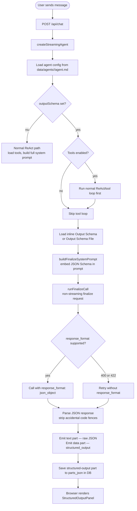

# Module 10 — Structured Output

← [Ecosystem Comparison](./09-ecosystem-comparison.md) | [Back to README](./README.md) | Next: [RAG →](./11-rag.md)

---

## Learning Objectives

After reading this module you will be able to:
- Explain the difference between tool-call JSON and structured output
- Describe when to use `response_format` vs. a tool call
- Trace the exact code path AgentPrimer uses for structured output agents
- Create a new extraction schema and wire it to a new agent in minutes
- Explain why the schema is embedded in the system prompt rather than enforced server-side
- Understand the dual rendering path (live streaming vs. historical DB restoration)

---

## The Core Concept: Two Ways to Get JSON From an LLM

Most developers first encounter JSON from an LLM via **tool calls**. The model emits a structured `tool_calls` block in the response, and the agent loop extracts arguments from it. That JSON is *always* partial — it is the model's representation of *what function to call and with what arguments*. It is a mechanism, not a deliverable.

**Structured output** is different. It is the JSON deliverable produced by a schema-focused LLM call. In AgentPrimer this is implemented as a **finalize call**: after a normal tool-capable conversation, or immediately for `Tools: none` schema agents, the model receives the transcript plus the inline schema and returns only a JSON object.

```
Tool call flow (ReAct):
  User → LLM → "I'll call get_weather(city='Tokyo')" → tool → result → LLM → text

Structured output flow:
  User → optional ReAct/tool loop → finalize LLM call → { city: "Tokyo", temp: 20, unit: "C", conditions: "sunny" }
                                      ↑ final JSON deliverable conforming to schema
```

The distinction matters because:
- The ReAct loop is optimized for *action* — calling tools, modifying state, answering questions
- Structured output is optimized for *extraction and finalization* — converting unstructured prose or an agent transcript into machine-readable data
- Mixing the two produces confusing architecture and unpredictable schemas

---

## Where Structured Output Is Used in Production

Structured output is one of the most common LLM patterns in real production systems:

| Use Case | Schema Shape | Example |
|----------|-------------|---------|
| **Document extraction** | entities, dates, money, parties | Contract parser, invoice processor |
| **Classification + routing** | enum category, confidence, reason | Support ticket router, email triage |
| **Data normalization** | typed address, phone, name | CRM import, form processing |
| **Meeting notes** | summary, action items, attendees | Post-call automation |
| **Agent routing decision** | next_agent, confidence, reasoning | Multi-agent orchestrator |
| **Evaluation / grading** | score, explanation, pass/fail | LLM-as-judge quality gate |

The `extractor` agent demonstrates one-shot document extraction with `Tools: none`; `extractor-with-tools` demonstrates research first, then a finalize call that structures the transcript.

---

## How AgentPrimer Implements Structured Output

### Overview



There are five distinct layers. Each is explained in detail below.

---

### Layer 1: Agent Configuration (`data/agents/<agent>/agent.md`)

Agents opt into structured output by adding a single field:

````markdown
# extractor
**System Prompt:** You are a structured data extraction agent. The user will
provide unstructured text and you will extract structured information from it.
You MUST respond with a valid JSON object. Do not include any prose.
**Output Schema:** Entity Extractor
Extracts people, organizations, dates, key facts, sentiment, and action items.
```json
{
  "type": "object",
  "properties": {
    "summary":    { "type": "string", "description": "1-3 sentence neutral summary" },
    "sentiment":  { "type": "string", "enum": ["positive","negative","neutral","mixed"] },
    "people":     { "type": "array", "items": { "type": "object" } },
    "key_facts":  { "type": "array", "items": { "type": "string" } }
  },
  "required": ["summary", "sentiment", "people", "key_facts"]
}
```
**Tools:** none
**Model:** default
````

The `**Output Schema:**` line is followed by a short description and a fenced `json` block containing the schema. Schemas can be defined two ways:

- **Inline** — fenced `json` block under the `**Output Schema:**` line inside `data/agents/<agent>/agent.md` (as shown above)
- **External file** — `**Output Schema File:** schemas/output.json` (path is relative to the agent folder). This is what `data/agents/extractor/agent.md` ships with, pointing at `data/agents/extractor/schemas/output.json`.

Use the external file when the schema is large or shared between agents; inline when it lives next to a single agent and you want one place to read.

**Key rule:** Use `**Tools:** none` for one-shot extraction agents. If a schema agent has tools enabled, AgentPrimer first runs the normal ReAct loop, then makes one extra finalize call that converts the completed transcript into JSON.

---

### Layer 2: Inline Schema or Schema File

Schemas can be embedded directly in the agent block:

````markdown
**Output Schema:** Entity Extractor
Extracts people, organizations, dates, key facts, sentiment, and action items from any text.
```json
{
  "type": "object",
  "description": "Structured information extracted from the input text",
  "properties": {
    "summary": { "type": "string" },
    "sentiment": { "type": "string", "enum": ["positive", "negative", "neutral", "mixed"] },
    "people": { "type": "array", "items": { "type": "object" } },
    "organizations": { "type": "array", "items": { "type": "string" } },
    "key_facts": { "type": "array", "items": { "type": "string" } },
    "dates_and_events": { "type": "array", "items": { "type": "object" } },
    "action_items": { "type": "array", "items": { "type": "string" } }
  },
  "required": ["summary", "sentiment", "people", "organizations", "key_facts", "dates_and_events", "action_items"]
}
```
````

Adding a new schema means adding either an `**Output Schema:**` label with a fenced `json` schema block, or an `**Output Schema File:**` path to a JSON file relative to the agent folder. No TypeScript registry file is required.

---

### Layer 3: System Prompt Engineering (`buildFinalizeSystemPrompt`)

The regular ReAct system prompt is ~300 lines long. It explains available tools, sub-agent protocols, memory format, and approval gate rules. A schema agent may either skip tools (`Tools: none`) or use normal tools first. In both cases, the final JSON is produced by a focused finalize prompt that is separate from normal tool-use instructions.

`buildFinalizeSystemPrompt` (in [`lib/agent/finalize.ts`](../lib/agent/finalize.ts)) builds a lean, focused prompt — note that it does **NOT** embed the agent's own role prompt. The agent's role was already in the loop transcript; the finalize prompt only describes how to convert that transcript into JSON:

```
You will receive a conversation transcript. Read it carefully, then emit a single JSON object that captures the final answer according to the schema below.

Rules:
- Output ONLY the raw JSON object — no prose, no explanation, no markdown code fences.
- Every field listed in "required" MUST be present in your output.
- Use an empty array `[]` or empty string `""` for fields with no applicable data.
- Do not add extra fields not in the schema.

## Schema: Entity Extractor
Extracts people, organizations, dates, key facts, sentiment, and action items.

```json
{
  "type": "object",
  "properties": { ... }
}
```
```

The schema is literally printed in the system prompt. This is intentional — it works with any model, including local models that don't support `response_format`.

---

### Layer 4: The LLM Call (`runFinalizeCall`)

Unlike the normal agent loop, the finalize step uses a **non-streaming call** (`stream: false`). The actual implementation lives in [`lib/agent/finalize.ts`](../lib/agent/finalize.ts). Three details that diverge from a naive "just call the API" version:

1. **A `finalize_call` data event is emitted *before* the API call fires**, plus a persisted `finalize-call` part is pushed onto the message's `allParts`. The UI shows a bubble with the exact request payload while the response is still in flight.
2. **Strict JSON parsing.** No code-fence stripping, no tolerant extraction. If `JSON.parse` fails, the structured-output panel shows `{ parse_error, raw_finalize_response }` so the operator can see exactly what the model returned.
3. **Provider-compat fallback.** Only when the first attempt throws `OpenAI.APIError` with status 400/422 — meaning "this provider doesn't accept `response_format`" — does it retry without `response_format`. Other errors propagate.

```typescript
// lib/agent/finalize.ts (lightly simplified)
async function runFinalizeCall({ openai, modelId, loopMsgs, finalText, schema, writer, allParts }) {
  const request = buildFinalizeRequest({ modelId, loopMsgs, finalText, schema });
  // request includes `max_tokens: getOutputLength(modelId)` and `response_format: { type: 'json_object' }`

  // 1) Emit pre-call bubble + persisted part
  allParts.push({ type: 'finalize-call', schemaLabel: schema.label, payload: toJSONValue(request) });
  writer.write(formatDataStreamPart('data', [
    { type: 'finalize_call', schemaLabel: schema.label, payload: toJSONValue(request) },
  ]));

  let response;
  try {
    response = await openai.chat.completions.create({ ...request });
  } catch (err) {
    // 3) Only fall back on the very specific 400/422 OpenAI.APIError
    if (err instanceof OpenAI.APIError && (err.status === 400 || err.status === 422)) {
      response = await openai.chat.completions.create({
        model: request.model, messages: request.messages, max_tokens: request.max_tokens,
      });
    } else {
      throw err;
    }
  }

  const rawText = response.choices[0]?.message?.content ?? '{}';

  // 2) Strict parse — surface parse errors instead of hiding them
  let data;
  try {
    data = JSON.parse(rawText);
  } catch (err) {
    data = {
      parse_error: `JSON.parse failed: ${(err as Error).message}`,
      raw_finalize_response: rawText,
    };
  }
  return { data, usage: normalizeTokenUsage(response.usage) };
}
```

The caller in `lib/agent/loop.ts` is what actually emits the live `structured_output` data event and pushes the persisted `structured-output` part once `runFinalizeCall` returns.

**Why non-streaming?** A JSON object cannot be partially rendered — you need the complete closing brace before you can parse it. Buffering a streaming response and waiting for the final token is equivalent to a non-streaming call, but more complex and error-prone.

**Why `response_format: { type: 'json_object' }` and not `json_schema`?**
- `json_schema` mode (also called "strict") is only available on OpenAI's GPT-4o series and a small set of providers
- `json_object` is supported by OpenAI, DeepSeek, most Ollama models, and LM Studio
- The schema in the system prompt provides the same structural guidance without provider lock-in
- The fallback without any `response_format` means the agent works even on the most restrictive local models

---

### Layer 5: Dual Rendering Path in the Frontend

Rendering structured output requires handling two fundamentally different cases:

```
Live session:   message.data[] ← populated by 2: stream parts during active stream
                message.parts  ← empty (parts only arrive via AI SDK reconstruction)

After reload:   message.data[] ← empty (not persisted to DB)
                message.parts  ← populated from parts_json column in SQLite
```

`MessageBubble` handles both:

```tsx
// Detect live structured output from data[] (streaming / just-completed)
const soFromData = data.find(d => d.type === 'structured_output');

// Detect historical structured output from parts (restored from DB)
const soFromParts = orderedParts.find(p => p.type === 'structured-output');

// Render whichever path applies
if (soFromParts) {
  return <StructuredOutputPanel data={soFromParts.data} ... />;
}
if (soFromData) {
  return <StructuredOutputPanel data={soFromData.data} ... />;
}
```

Notice the underscore vs. hyphen spelling:
- `structured_output` (underscore) — wire format, JSON inside `2:` data stream parts
- `structured-output` (hyphen) — parts array format, stored in `parts_json` in SQLite

This is intentional. The two spellings make it clear which path a value came from. They are never confused because each lives in a different field of the message object.

---

## The `StructuredOutputPanel` Component

The panel renders structured JSON as a human-readable field table instead of raw code:

```
┌─ Structured Output  [Entity Extractor]  [Copy] ──────────────────────┐
│ summary      │ Meeting to discuss Q3 results and 2026 planning.       │
│ sentiment    │ ● positive                                             │
│ people       │ • name: Jane Smith  role: VP Sales  email: j@acme.com │
│              │ • name: Tom Lee     role: CTO        email: t@acme.com │
│ organizations│ • Acme Corp                                            │
│ key_facts    │ • Q3 revenue up 18% YoY                                │
│              │ • Two new hires approved for engineering               │
│ action_items │ • Tom to send budget proposal by Friday                │
├─ Raw JSON ▶ (collapsed) ──────────────────────────────────────────────┤
└───────────────────────────────────────────────────────────────────────┘
```

Special rendering rules:
- `sentiment` enum values → colored badge (green/red/gray/amber)
- Array of strings → bullet list
- Array of objects → inline key: value pairs on each bullet
- Primitive values → plain text
- Raw JSON toggle → collapsible `<details>` showing the full JSON string

---

## How to Add a New Extraction Schema

1. **Add an agent and schema** in `data/agents/<agent>/agent.md`:

````markdown
# support-classifier
**System Prompt:** You are a support ticket classification agent. The user will
provide a raw support ticket and you will classify it.
**Output Schema:** Support Ticket Classifier
Classifies a support ticket by category, priority, sentiment, route, and reason.
```json
{
  "type": "object",
  "properties": {
    "category": { "type": "string", "enum": ["billing", "technical", "account", "general"] },
    "priority": { "type": "string", "enum": ["critical", "high", "medium", "low"] },
    "sentiment": { "type": "string", "enum": ["positive", "negative", "neutral", "mixed"] },
    "summary": { "type": "string" },
    "route_to": { "type": "string" },
    "reason": { "type": "string" }
  },
  "required": ["category", "priority", "sentiment", "summary", "route_to", "reason"]
}
```
**Tools:** none
**Model:** default
````

2. **Reload the agents list** — no server restart needed, `data/agents/<agent>/agent.md` is parsed on each request.

3. **Select the new agent** from the agent dropdown in the chat UI and send a ticket.

That is the complete workflow. No new API routes, no new React components, no database migrations.

---

## Key Design Decisions

### Why embed the schema in the system prompt?

Three reasons:
1. **Provider compatibility** — `json_schema` strict mode is not universal. System-prompt schema works everywhere.
2. **Transparency** — The model can read its own schema. Learners can see exactly what the model was told.
3. **Flexibility** — You can add prose instructions alongside the schema ("If email is missing, use empty string not null"), which you cannot do in the schema validator itself.

### Why non-streaming?

JSON cannot be meaningfully rendered until it is complete. Streaming a partial `{"summary": "Meeting to discuss` offers zero UI value. A single spinner followed by the full panel is a better experience.

### Why not Zod for schema generation?

Zod is used elsewhere in the codebase to generate JSON Schema for tool registration. For structured output, the schema is hand-written JSON Schema for two reasons:
1. The schema is embedded in the system prompt as readable JSON — Zod's generated output adds `$schema`, `additionalProperties`, and other fields that add noise to the prompt
2. Structured output schemas are data-contract documents, not validation code — they belong alongside agent configuration, not in a TypeScript type file

---

## Exercises

1. **Trace the code path.** Starting from `POST /api/chat`, trace every function call that fires when a message is sent to the `extractor` agent. List the functions in order.

2. **Add a new schema.** Define a `summarize_article` schema with fields: `headline` (string), `one_sentence_summary` (string), `key_points` (array of strings), `target_audience` (string), `word_count_estimate` (number). Create a matching agent in `data/agents/<agent>/agent.md` and test it.

3. **Explain the rendering paths.** Why does `StructuredOutputPanel` need two code paths (from `data` and from `parts`)? What happens to `message.data` when you reload the browser?

4. **Investigate the fallback.** In `runFinalizeCall`, the retry without `response_format` exists for local models. Start Ollama and point AgentPrimer at a local model. Does the `extractor` agent still work? What is different about the response?

5. **Add a sentiment badge for your schema.** The `StructuredOutputPanel` renders a colored badge for `sentiment` fields. Extend `StructuredFieldValue` so that `priority` fields (`critical`, `high`, `medium`, `low`) also render as badges with appropriate colors (red, orange, yellow, green).

---

See: [Back to README →](./README.md) | Continue to [Module 11 — RAG →](./11-rag.md)
