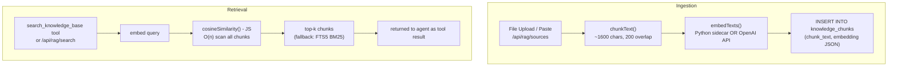

# Module 11 — RAG

← [Structured Output](./10-structured-output.md) | [Back to README →](./README.md)

---

## Learning Objectives

After reading this module you will be able to:
- Explain why flat-file memory breaks at scale and what RAG solves
- Trace the complete ingestion pipeline: chunk → embed → store
- Trace the retrieval pipeline: embed query → cosine similarity → inject
- Understand the Python embedding sidecar and its graceful degradation design
- Use the RAG UI to upload, search, and manage documents
- Use the `search_knowledge_base` tool in an agent

---

## The Problem This Solves

Open `data/agents/<agent>/memory.md`. Everything in that file is injected verbatim into the system prompt of **every** agent on **every** turn.

This is fine for a few hundred tokens. It breaks at scale:

| Problem | What happens |
|---------|-------------|
| **Context overflow** | Memory grows past ~5k tokens; attention softmax dilutes distant tokens; the model silently "forgets" facts that are technically in the prompt |
| **Relevance noise** | 200 facts across 12 projects; user asks about Project A; the 185 irrelevant facts degrade response quality |
| **No document understanding** | Cannot read uploaded PDFs, query a policy runbook, or answer questions about codebases not manually described in agents/<agent>/memory.md |

**RAG (Retrieval-Augmented Generation)** solves this: retrieve only the top-k relevant text chunks at query time and inject *only those* into the prompt.

---

## Architecture



---

## The Python Embedding Sidecar

Local embeddings are handled by **`scripts/embed_server.py`**, a lightweight Python HTTP server that runs alongside Next.js.

```
Port:    15434
Startup: scripts/start.sh starts it before Next.js
Model:   fastembed all-MiniLM-L6-v2 (384-dim, ~90 MB ONNX model)
Cache:   data/models/  (persisted across container restarts)
```

### API

| Endpoint | Method | Body | Response |
|----------|--------|------|----------|
| `/health` | GET | — | `{"status":"ok","model":"all-MiniLM-L6-v2","backend":"fastembed"}` |
| `/embed` | POST | `{"texts": ["...", "..."]}` | `{"embeddings": [[0.023,...],[...]]}` |

### Graceful Degradation

If `fastembed` or `onnxruntime` cannot be installed (e.g., missing glibc on musl/Alpine Linux), the sidecar starts in **degraded mode**:

```json
GET /health → {"status": "degraded", "error": "fastembed not available"}
POST /embed  → HTTP 503
```

When the sidecar is degraded, `lib/rag.ts` automatically falls back to **SQLite FTS5 keyword search**. RAG still works — results just use BM25 ranking instead of semantic similarity.

**Production note:** The Docker image uses `node:20-slim` (Debian/glibc) and installs `fastembed` best-effort. If a compatible wheel is unavailable, the sidecar still starts in degraded mode and the application uses FTS5 fallback.

### Cloud Embedding Alternative

Set `embedding_provider = openai` in Settings to use `text-embedding-3-small` (1536-dim) instead of the local sidecar. Requires an OpenAI API key. Higher quality but costs money and requires outbound network access.

---

## `lib/rag.ts` — The Core Module

### `chunkText(text: string): string[]`

Splits text into ~1600-char chunks with 200-char paragraph-aware overlap. The overlap ensures facts that span a chunk boundary appear in at least one complete chunk.

### `embedTexts(texts: string[]): Promise<number[][] | null>`

Calls the Python sidecar at `http://localhost:15434/embed`. Returns `null` if degraded. Callers fall back to FTS5 when `null` is returned. Batched internally at 50 texts per call.

### `ingestDocument({ name, sourceType, content, originalContent?, originalBytes?, originalMime? })`

Full ingestion pipeline, idempotent via MD5 hash:

```
1. Compute MD5 of content
2. Skip if (name, md5) already in knowledge_sources
3. Delete old chunks for this source name (clean re-ingest on change)
4. INSERT knowledge_sources row (stores original document in original_content/original_blob/original_mime for the View panel)
5. chunkText(content) → chunks[]
6. embedTexts(chunks) → embeddings[][] (or null → store NULL embedding)
7. INSERT knowledge_chunks rows (chunk_text, embedding JSON)
```

### `retrieveChunks(query: string, topK = 5): Promise<string[]>`

```
1. embedTexts([query]) → queryVector
2. If queryVector is null → FTS5 fallback:
     SELECT chunk_text FROM knowledge_fts WHERE knowledge_fts MATCH ? LIMIT topK
3. Otherwise:
     Load all (chunk_text, embedding) from knowledge_chunks
     cosineSimilarity(queryVector, chunkEmbedding) for each chunk
     Sort desc, return top topK chunk_text strings
```

### Other exports

| Function | Description |
|----------|-------------|
| `checkEmbedHealth()` | Calls `/health`; returns `{ok, status, model?, backend?, error?}` |
| `listSources()` | Returns all knowledge_sources with chunk counts |
| `getSourceMeta(id)` | Returns `{id, name, mime}` for a single source — used by the View panel |
| `getSourceContent(id)` | Returns `{id, name, mime, content, bytes}` — the full original document for inline/iframe rendering |
| `deleteSource(id)` | Deletes a source; cascades to chunks via FK |
| `getSourceCount()` | Count of sources |
| `currentModelId()` | `'local:all-MiniLM-L6-v2'` or `'openai:text-embedding-3-small'` based on settings |

---

## The `search_knowledge_base` Built-in Tool

Agents search the RAG index via the `search_knowledge_base` built-in tool:

```typescript
parameters: z.object({
  query: z.string().describe('Describe what information you need'),
  top_k: z.number().optional().describe('How many chunks to return (default 5, max 20)'),
})
```

The tool calls `retrieveChunks(query, top_k)` and returns matching text as the tool result. The agent uses that context to answer the user.

**The agent does NOT auto-retrieve on every turn** — it must decide to call `search_knowledge_base`. This is standard RAG design and has educational value: you can watch the agent choose when to search vs. answer from memory.

---

## The RAG UI (`/knowledge`)

### Health Badge
- `● ok — local:all-MiniLM-L6-v2` (green) — sidecar running, vector embeddings active
- `● degraded` (amber) — sidecar running but fastembed unavailable; FTS5 fallback
- `● error` (red) — sidecar unreachable

### Ingest Tab
- **Paste** — paste Markdown/plain text with a source name
- **Upload** — drag-drop file (`.txt`, `.md`, `.pdf`)

Handled by `POST /api/rag/sources`. PDF files are extracted to text before chunking.

### Sources List
Lists all sources with name, type badge, chunk count, ingestion time, a View button, and a Delete button.

### Document Preview (View Panel)
Clicking the **View** button on a source opens the `RagViewerPanel` — a resizable right-side panel that renders the original document:
- **Text/Markdown** — rendered inline with syntax highlighting
- **HTML** — rendered in a sandboxed `<iframe>` via data: URL
- **PDFs** — rendered via `<iframe>` with the browser's native PDF viewer

The panel fetches the full document via `GET /api/rag/sources/[id]/content` backed by `getSourceContent()` and `getSourceMeta()`.

### Send-to-RAG Workflow
From any chat session, the **Send to RAG** button (`SendToRagDialog`) allows ingesting assistant responses directly:
1. **Summary mode** (default) — `POST /api/rag/summarize` sends the message/session to the chat LLM for summarization, then ingests the summary into RAG with an auto-detected source type
2. **Content mode** — ingests the raw message content directly without summarization
3. Shows progress and reports ingestion errors clearly. If ingestion fails, retry or delete the partially created source from the RAG page before re-ingesting.

### Search Test Panel

## API Routes

| Route | Method | Description |
|-------|--------|-------------|
| `/api/rag/health` | GET | Proxy to Python sidecar `/health` |
| `/api/rag/sources` | GET | List all sources with chunk counts |
| `/api/rag/sources` | POST | Ingest a document (name + content) |
| `/api/rag/sources/[id]` | DELETE | Delete a source and all chunks |
| `/api/rag/sources/[id]/content` | GET | Fetch original document content/meta for the View panel |
| `/api/rag/search` | POST | Run a test retrieval query |
| `/api/rag/summarize` | POST | Summarize a message or session for RAG ingestion (Send-to-RAG workflow) |

---

## Why Cosine Similarity (Not Euclidean Distance)?

Cosine similarity measures the *angle* between vectors, not magnitude. Two chunks saying the same thing with different words may have similar directions but different magnitudes — cosine catches the similarity; Euclidean misses it.

```typescript
function cosineSimilarity(a: number[], b: number[]): number {
  let dot = 0, magA = 0, magB = 0;
  for (let i = 0; i < a.length; i++) {
    dot  += a[i] * b[i];
    magA += a[i] * a[i];
    magB += b[i] * b[i];
  }
  return dot / (Math.sqrt(magA) * Math.sqrt(magB));
}
```

O(dimensions × chunks) — for 384-dim and 10k chunks: ~3.8M multiplications, well within Node.js limits for typical RAG indexes.

---

## Limitations and Upgrade Paths

| Limitation | Current state | Upgrade path |
|-----------|---------------|-------------|
| **O(n) retrieval** | Full table scan per query | Add `sqlite-vec` extension for HNSW approximate nearest-neighbor |
| **384-dim local model** | Lower quality than large models | Set `embedding_provider = openai` in Settings |
| **Manual tool call** | Agent must choose to search with `search_knowledge_base` | Add auto-retrieval hook in `buildSystemPrompt()` |
| **No re-ranking** | Top-k by cosine only | Add cross-encoder re-ranking for better precision |
| **Text only** | No image/audio ingestion | Call vision model during ingestion to describe images |

---

## Exercises

1. **Upload a document:** Go to `/knowledge`, paste a product spec or README, and ingest it. Ask the agent a question about that content and watch it call `search_knowledge_base`.

2. **Inspect chunks via SQL:**
   ```sql
   SELECT chunk_index, substr(chunk_text, 1, 100)
   FROM knowledge_chunks kc
   JOIN knowledge_sources ks ON kc.source_id = ks.id
   WHERE ks.name = 'your-doc.md';
   ```

3. **Force FTS5 fallback:** Stop the embed server. Reload the RAG page, observe the `degraded` badge, run a search, and verify it still returns results.

4. **Compare embedding vs. keyword search:** Ingest a doc using synonyms. Search with a term that doesn't appear verbatim. Compare vector results vs. FTS5 results to understand why embeddings matter.

5. **Add auto-retrieval:** In `lib/agent.ts`, modify `buildSystemPrompt()` to automatically call `retrieveChunks(lastUserMessage, 3)` and prepend the results. Discuss trade-offs vs. the current tool-based approach.

---

## Further Reading

- RAG paper: [Retrieval-Augmented Generation paper](https://arxiv.org/abs/2005.11401)
- fastembed: [github.com/qdrant/fastembed](https://github.com/qdrant/fastembed)
- sqlite-vec: [github.com/asg017/sqlite-vec](https://github.com/asg017/sqlite-vec)

See: ← [Structured Output](./10-structured-output.md) | [Back to README →](./README.md)
