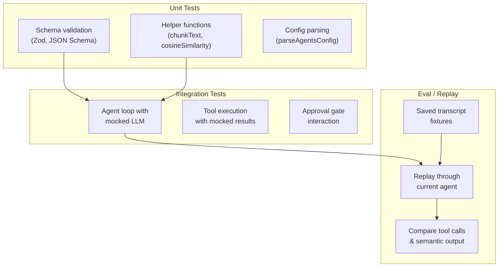

# Module 13 — Testing AI Agents
← [Deployment & Production](./12-deployment-production.md) | Next: [Multi-Agent Orchestration →](./14-multi-agent-orchestration.md)


---

## Learning Objectives

After reading this module you will be able to:
- Explain why testing AI agents is fundamentally different from testing traditional software
- Mock an LLM API call to test agent behavior without real API costs or latency
- Write tests that verify the correct tools are called with the expected arguments
- Test structured output agents by asserting JSON schema conformance
- Test error paths: API failures, timeouts, malformed responses, and approval gates
- Design an eval harness that replays saved transcripts to detect regressions

---

## Why Testing AI Agents is Different

In traditional software, the same input always produces the same output. AI agents break this assumption:

| Dimension | Traditional testing | AI agent testing |
|-----------|-------------------|------------------|
| **Determinism** | Same input → same output | Same input → different output (LLM is non-deterministic) |
| **Dependency** | Mock databases, files, APIs | Must mock the LLM itself (cost, latency, non-determinism) |
| **Assertions** | Assert exact values | Assert structure, tool call patterns, or semantic similarity |
| **Side effects** | Controlled | Tool calls create real side effects (files, network, subprocesses) |
| **Flakiness** | Rare | Common — model updates, prompt drift, temperature changes |

The key insight: **you cannot assert what the LLM *says*, but you can assert what the agent *does***. Focus tests on tool call patterns, error handling, and output structure rather than exact text matches.

---

## Testing Strategy Overview



| Test type | What it covers | Speed | When to use |
|-----------|---------------|-------|-------------|
| **Unit tests** | Individual functions, schema validation, config parsing | Fast (~ms) | Every PR |
| **Integration tests** | Agent loop with mocked LLM, tool dispatch, approval flow | Medium (~s) | Feature branches |
| **Eval / Replay** | Full transcript regression, semantic output comparison | Slow (~min) | Release candidates |

---

## Mocking the LLM

The agent loop calls `openai.chat.completions.create()` to get responses from the LLM. To test without a real API, you mock this call. AgentPrimer's tests use three patterns:

### Pattern 1: `vi.mock` the OpenAI module

Replace the entire `openai` module with a mock that returns controlled responses:

```typescript
import { vi, describe, it, expect } from 'vitest';

vi.mock('openai', () => {
  return {
    default: class {
      chat = {
        completions: {
          create: vi.fn().mockResolvedValue({
            choices: [{
              message: { content: 'Hello from the mock!' },
              finish_reason: 'stop',
            }],
          }),
        },
      };
    },
  };
});
```

### Pattern 2: `vi.fn` for streaming responses

For testing the streaming ReAct loop, mock the async iterable that the OpenAI SDK returns:

```typescript
function mockStream(chunks: Array<{ content?: string; toolCalls?: any; finishReason?: string }>) {
  return {
    [Symbol.asyncIterator]: async function* () {
      for (const chunk of chunks) {
        const delta: Record<string, any> = {};
        if (chunk.content) delta.content = chunk.content;
        if (chunk.toolCalls) delta.tool_calls = chunk.toolCalls;

        yield {
          choices: [{
            delta,
            finish_reason: chunk.finishReason ?? null,
          }],
        };
      }
    },
  };
}

// Usage in a test:
const mockCreate = vi.fn().mockResolvedValue(mockStream([
  { content: 'Let me check that file...' },
  { toolCalls: [{ index: 0, function: { name: 'read_file', arguments: '{"file_path":"data/tmp/test.txt"}' } }] },
  { finishReason: 'tool_calls' },
]));
```

### Pattern 3: `vi.spyOn` with temp directory (existing pattern)

AgentPrimer's existing tests use `vi.spyOn(process, 'cwd')` to redirect file paths to a temp directory, combined with `vi.resetModules()` to get fresh module state:

```typescript
let tempDir: string;

async function loadAgent() {
  vi.resetModules();
  return import('../lib/agent');
}

beforeEach(() => {
  tempDir = fs.mkdtempSync(path.join(os.tmpdir(), 'agentprimer-'));
  fs.mkdirSync(path.join(tempDir, 'data'), { recursive: true });
  vi.spyOn(process, 'cwd').mockReturnValue(tempDir);
});

afterEach(() => {
  vi.restoreAllMocks();
  fs.rmSync(tempDir, { recursive: true, force: true });
});
```

This pattern is used in all existing test files under `tests/`. See [tests/agent.test.ts](../tests/agent.test.ts) for a complete example.

### Existing Test Files

The `tests/` directory contains the following test suites (configured via `vitest.config.ts`):

| Test file | What it covers |
|-----------|---------------|
| `agent.test.ts` | Agent config parsing, system prompt building |
| `agent-loop.test.ts` | Streaming ReAct loop with mocked LLM |
| `approval-store.test.ts` | Approval gate scoping (once/session/permanent) |
| `auth.test.ts` | JWT sign/verify and bcrypt password hashing |
| `builtin-tools-registry.test.ts` | Tool enable/disable state management |
| `db.test.ts` | SQLite schema migration and CRUD helpers |
| `function-tools-loader.test.ts` | Subprocess function tool execution |
| `installer.test.ts` | GitHub clone, npm install, manifest validation |
| `memory.test.ts` | `agent.md` / `memory.md` read/write operations |
| `rag.test.ts` | Chunking, embedding, ingestion, and retrieval |
| `skills-loader.test.ts` | SKILL.md discovery and activation |

Run all tests with:

```bash
npm test           # vitest run
npx vitest --watch # watch mode
```

---

## Testing Tool Calls

The most important thing to test in an agent is **which tools it calls and with what arguments**. This is more reliable than testing what the LLM says.

### Asserting tool call arguments

```typescript
it('calls read_file with the requested path', async () => {
  const mockCreate = vi.fn().mockResolvedValue({
    choices: [{
      message: {
        content: null,
        tool_calls: [{
          id: 'call-1',
          type: 'function',
          function: {
            name: 'read_file',
            arguments: JSON.stringify({ file_path: 'data/tmp/test.txt' }),
          },
        }],
      },
      finish_reason: 'tool_calls',
    }],
  });

  // Inject mock into the agent's OpenAI client
  // Then run the agent loop and assert:
  // 1. read_file was called with file_path = 'data/tmp/test.txt'
  // 2. The tool result was fed back into the next LLM call
  // 3. The agent eventually returned a final response
});
```

### Testing the approval gate

When an unapproved `delete_path` call is made, the tool returns a special result indicating approval is needed:

```typescript
it('returns requires_approval when deleting without prior approval', async () => {
  const { isApproved } = await import('../lib/approval-store');

  // No approval granted yet
  expect(isApproved('session-1', 'delete', '/tmp/file.txt')).toBe(false);

  // The tool should return { requires_approval: true, ... }
  const result = await deletePath({ path: '/tmp/file.txt' }, 'session-1');
  expect(result.requires_approval).toBe(true);
});
```

### Testing error paths

```typescript
it('returns an error for malformed tool arguments', async () => {
  // read_file requires a 'file_path' string
  const result = await readFile({ file_path: 123 }, 'session-1');
  expect(result).toHaveProperty('error');
  expect(result.error).toContain('validation');
});
```

---

## Testing Structured Output

Structured output agents always finish with a non-streaming finalize call. `Tools: none` schema agents skip directly to that finalize step; schema agents with tools first run the normal ReAct loop, then finalize the transcript.

The prompt builder is exported, so unit tests can verify schema injection without mocking an LLM:

```typescript
import { buildFinalizeSystemPrompt } from '@/lib/agent';

it('includes the schema in the finalize prompt', () => {
  const prompt = buildFinalizeSystemPrompt({
    label: 'Entity Extractor',
    description: 'Extracts entities',
    schema: {
      type: 'object',
      properties: {
        sentiment: { type: 'string', enum: ['positive', 'negative', 'neutral', 'mixed'] },
      },
      required: ['sentiment'],
    },
  });

  expect(prompt).toContain('Entity Extractor');
  expect(prompt).toContain('sentiment');
  expect(prompt).toContain('positive');
});
```

For end-to-end structured-output behavior, mock `openai.chat.completions.create()` in an integration test and assert that the saved message contains a `structured-output` part in `parts_json`.

---

## Integration Testing the Agent Loop

A full integration test mocks the LLM at each step of the ReAct loop and asserts the correct sequence of events:

```typescript
it('completes a multi-step ReAct loop: tool call → result → final answer', async () => {
  // Step 1: LLM decides to call get_time
  // Step 2: Tool executes, returns result
  // Step 3: LLM produces final answer using the tool result

  const steps = [
    { toolCalls: [{ name: 'get_time', args: { format: 'iso' } }], finishReason: 'tool_calls' },
    { content: 'The current time is 2026-06-02T12:00:00Z', finishReason: 'stop' },
  ];

  let stepIndex = 0;
  const mockCreate = vi.fn().mockImplementation(() => {
    const step = steps[stepIndex++];
    return mockStream([step]);
  });

  // Run createStreamingAgent with a mocked OpenAI client/module
  const result = await createStreamingAgent({ /* config with mocked client */ });

  // Assert the final output
  expect(result.text).toContain('2026-06-02');
});
```

---

## Testing Function Tools and MCP Servers

### Testing a function tool subprocess

Function tools run in isolated subprocesses via `function-tools-loader.ts`. Test them through the exported loader and the returned tool's `execute` function:

```typescript
it('executes a function tool and returns the result', async () => {
  const { loadFunctionTools } = await import('../lib/function-tools-loader');
  const tools = loadFunctionTools('all');

  const result = await tools.calculator.execute({ expression: '2 + 2' });

  expect(result).toEqual({ result: 4 });
});
```

See [tests/function-tools-loader.test.ts](../tests/function-tools-loader.test.ts) for the existing test that loads a real function tool JS file and executes it.

### Testing SKILL.md skills

SKILL.md skills are instruction modules injected into the system prompt — they don't execute code. Testing them means verifying that the system prompt contains the expected skill instructions when a skill is enabled:

```typescript
it('injects skill context into system prompt', async () => {
  const { buildSkillDiscoverySection } = await import('../lib/skills-loader');
  const { section, skills } = buildSkillDiscoverySection('all');
  
  expect(skills.length).toBeGreaterThan(0);
  expect(section).toContain('## Available Skills');
  expect(section).toContain('hello-world');
});
```

MCP tool loading can be tested by mocking `Client.listTools()`:

```typescript
it('discovers tools from an MCP server', async () => {
  vi.mock('@modelcontextprotocol/sdk/client/index.js', () => ({
    Client: class {
      async connect() {}
      async listTools() {
        return {
          tools: [{
            name: 'get_current_time',
            description: 'Returns the current time',
            inputSchema: {
              type: 'object',
              properties: {
                format: { type: 'string', description: 'Time format' },
              },
              required: ['format'],
            },
          }],
        };
      }
      async close() {}
    },
  }));

  const { loadMcpTools } = await import('../lib/mcp-client');
  const tools = await loadMcpTools('all');

  expect(tools).toHaveProperty('datetime__get_current_time');
});
```

---

## Writing an Eval Harness

An eval harness replays saved conversation transcripts through the current agent and compares outputs. This catches regressions when you change prompts, tools, or the agent loop.

### Fixture format

```typescript
interface EvalFixture {
  name: string;
  input: {
    messages: Array<{ role: 'user' | 'assistant'; content: string }>;
    agentName: string;
  };
  expected: {
    // Expected tool calls in order (exact match)
    toolCalls?: Array<{ toolName: string; args?: Record<string, unknown> }>;
    // Text that must appear in the final response (substring match)
    outputContains?: string[];
    // Expected approval events
    approvalEvents?: Array<{ operation: string; path?: string }>;
  };
}
```

### Minimal eval runner

```typescript
import { readFileSync, readdirSync } from 'fs';
import { createStreamingAgent } from '../lib/agent';

async function runEval(fixturePath: string) {
  const fixture = JSON.parse(readFileSync(fixturePath, 'utf-8'));
  const result = await createStreamingAgent({
    messages: fixture.input.messages,
    agentName: fixture.input.agentName,
  });

  const failures: string[] = [];

  // Check expected tool calls
  if (fixture.expected.toolCalls) {
    for (const expected of fixture.expected.toolCalls) {
      const actual = result.toolCalls.find(t => t.name === expected.toolName);
      if (!actual) {
        failures.push(`Missing tool call: ${expected.toolName}`);
      }
    }
  }

  // Check expected output text
  if (fixture.expected.outputContains) {
    for (const substr of fixture.expected.outputContains) {
      if (!result.text.includes(substr)) {
        failures.push(`Output missing: "${substr}"`);
      }
    }
  }

  return { name: fixture.name, passed: failures.length === 0, failures };
}

// Run all fixtures
const fixtures = readdirSync('./tests/fixtures/').filter(f => f.endsWith('.json'));
for (const fixture of fixtures) {
  const result = await runEval(`./tests/fixtures/${fixture}`);
  console.log(`${result.passed ? '✓' : '✗'} ${result.name}`);
  if (!result.passed) result.failures.forEach(f => console.log(`  ${f}`));
}
```

### Comparing with semantic similarity

For text responses where exact match is too brittle, use embeddings to compare semantic similarity:

```typescript
import { cosineSimilarity } from '../lib/rag';

async function semanticSimilarity(a: string, b: string): Promise<number> {
  // Use the Python embedding sidecar or an API
  const response = await fetch('http://127.0.0.1:15434/embed', {
    method: 'POST',
    body: JSON.stringify({ texts: [a, b] }),
  });
  const { embeddings } = await response.json();
  return cosineSimilarity(embeddings[0], embeddings[1]);
}

// In a test:
const similarity = await semanticSimilarity(actual, expected);
expect(similarity).toBeGreaterThan(0.85); // Threshold depends on your use case
```

---

## Exercises

1. **Mock a streaming text response.** Write a test that mocks `openai.chat.completions.create` to return a stream with a single text chunk: `{ choices: [{ delta: { content: "Hello world" }, finish_reason: "stop" }] }`. Run it through `createStreamingAgent` and assert the final output contains "Hello world".

2. **Mock a tool call response.** Write a test where the mock returns a `tool_calls` finish with `read_file` arguments `{ file_path: "data/tmp/test.txt" }`. Assert that `read_file` is called with the expected path and that the tool result is included in the next LLM call.

3. **Test the approval gate.** Mock a `delete_path` call with no prior approval. Assert the tool result contains `requires_approval: true`. Then grant a session-level approval and assert the tool executes successfully.

4. **Test structured output fallback.** Mock the first `create` call to throw with status 400, and the second to return a valid JSON object. Assert the agent retries without `response_format` and returns the parsed object.

5. **Test error recovery.** Mock the first LLM call to throw a vision rejection error (status 400 with a vision-related message). Assert the agent retries without multimodal content and succeeds on the second attempt.

6. **Write an eval fixture.** Create a JSON fixture file with a sample conversation and expected tool calls. Write a script that replays it through `createStreamingAgent` and reports pass/fail for each expected tool call. Run it against the current agent.

---

## Further Reading

- Vitest mocking guide: [vitest.dev/guide/mocking](https://vitest.dev/guide/mocking)
- Testing AI applications (Anthropic): [docs.anthropic.com/en/docs/test-and-evaluate](https://docs.anthropic.com/en/docs/test-and-evaluate)
- Eval-driven development (OpenAI): [platform.openai.com/docs/guides/evaluation](https://platform.openai.com/docs/guides/evaluation)
- Semantic similarity with all-MiniLM-L6-v2: [huggingface.co/sentence-transformers/all-MiniLM-L6-v2](https://huggingface.co/sentence-transformers/all-MiniLM-L6-v2)

---

See: ← [Deployment & Production](./12-deployment-production.md) | [Back to README →](./README.md)
