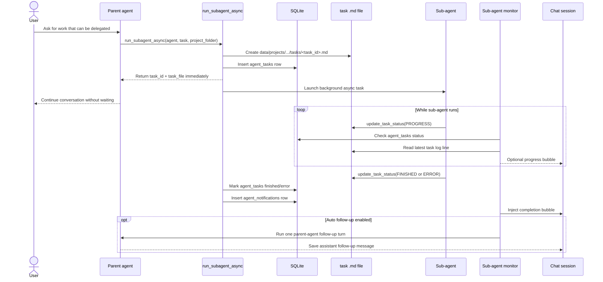

# Module 14 — Multi-Agent Orchestration

← [Testing AI Agents](./13-testing-agents.md) | [Back to README →](./README.md)

---

## Learning Objectives

After reading this module you will be able to:
- Explain how AgentPrimer launches background sub-agents without blocking the parent chat turn
- Trace the lifecycle of an async task from `run_subagent_async` to task file, database row, notification, monitor bubble, and optional auto-follow-up
- Understand why the parent agent should not manually poll task files after launch
- Distinguish between task notifications, polling bubbles, and experimental automatic parent follow-up
- Identify the limits of this lightweight orchestration model and where a production system would need a durable job runner

---

## Why Multi-Agent Orchestration Exists

A single ReAct agent is good at sequential work:

```text
Think → call tool → read result → call next tool → answer
```

But some work is naturally parallel:

- research while the parent continues planning
- code generation by a specialized coder agent
- review by a separate critic agent
- extraction, summarization, or validation tasks that can run independently

AgentPrimer supports this with **async sub-agents**. A parent agent can delegate work to another named agent and immediately continue the current conversation instead of waiting for the sub-agent to finish.

The goal is not to implement a full enterprise workflow engine. The goal is to teach the core mechanics of multi-agent coordination with enough transparency that learners can see every step.

---

## High-Level Flow



There are three separate mechanisms here:

| Mechanism | Purpose | Requires user prompt? | Requires LLM call? |
|---|---|---:|---:|
| `agent_tasks` row | Durable task index | No | No |
| `agent_notifications` row | Let parent learn completion on next turn | Yes, for parent reasoning | No by itself |
| Sub-agent monitor | Show progress/completion bubbles automatically | No | No for bubbles |
| Auto follow-up | Parent agent proactively summarizes and continues | No | Yes, one parent LLM call |

---

## The Core Tool: `run_subagent_async`

The parent agent launches a sub-agent by calling:

```text
run_subagent_async({
  agent_name: "coder",
  task: "Build a browser game in data/projects/snake-game",
  project_folder: "data/projects/snake-game"
})
```

Implementation lives in `lib/agent/builtin-tools.ts` inside `createBuiltinTools()` (re-exported via the `lib/agent` barrel).

When called, it:

1. Generates a `task_id`.
2. Creates a task file under `<project_folder>/tasks/<task_id>.md`. By convention parent agents pass a folder under `data/projects/<project>/`, e.g.:

   ```text
   data/projects/<project>/tasks/<task_id>.md
   ```

   `project_folder` is **not** sandboxed at the tool layer — it is whatever path the parent agent supplied. The convention exists so all task files end up under `data/` and are picked up by `list_tasks` / the monitor; the tool will still create the directory wherever it is told to.

3. Inserts a row into `agent_tasks`.
4. Starts `runSubagentWithTaskFile(...)` in the background.
5. Returns immediately to the parent agent with:

   ```json
   {
     "task_id": "...",
     "task_file": "...",
     "status": "started"
   }
   ```

This is why the parent chat does not block while the sub-agent works.

---

## Task Files as Transparent Logs

Every async task has a Markdown task file. It is both human-readable and machine-readable enough for simple monitoring.

Example:

```markdown
# Task 2cd15cca-4d36-49ec-ba6b-7c358bcc96a3

**Assigner:** main
**Assignee:** coder
**Started:** 2026-06-13T12:00:00.000Z
**Status:** running

## Prompt
Build a small HTML canvas game...

## Log
[2026-06-13T12:00:00.000Z] STARTED
[2026-06-13T12:00:05.000Z] STATUS:RUNNING
[2026-06-13T12:00:20.000Z] PROGRESS: Created project folder and index.html
[2026-06-13T12:00:45.000Z] PROGRESS: Added game loop and keyboard controls
[2026-06-13T12:01:10.000Z] FINISHED: Created snake game and opened preview
```

Sub-agents are instructed to call:

- `update_task_status({ message: "..." })` for progress
- `update_task_status({ message: "summary", finished: true })` when done
- `update_task_status({ error: "reason" })` on failure

This keeps task progress visible without requiring a dedicated event bus.

---

## Database Tables

Multi-agent orchestration uses two SQLite tables.

### `agent_tasks`

Tracks the background work itself:

```text
id
project_folder
assigner
assignee
prompt
task_file
status
created_at
finished_at
```

This table powers `list_tasks` and lets the monitor know whether a task is still running, finished, failed, or interrupted.

### `agent_notifications`

Queues completion events for the parent chat session:

```text
id
session_id
task_id
task_file
summary
created_at
read_at
```

When the sub-agent finishes, AgentPrimer creates an `agent_notifications` row. On the next parent-agent turn, `createStreamingAgent()` (in `lib/agent/streaming-agent.ts`) loads pending notifications and injects them into the parent agent's system prompt.

That means even without automatic monitor bubbles, the parent agent can learn about completed sub-agent work on the next user message.

---

## Why Agents Should Not Poll Task Files Manually

Older versions of the system prompt told parent agents to poll the returned task file with `read_file`. That worked, but it had problems:

- it wasted context and tool calls
- it encouraged noisy chat behavior
- it forced the parent agent to spend turns checking status instead of helping the user
- it mixed orchestration infrastructure with agent reasoning

The current guidance in `defaults/system.md` is:

```text
Do not poll the returned task file after launch. The platform monitors async sub-agents and surfaces progress/completion notifications in the chat/session when available.
```

The parent agent should continue useful work. It should only call `list_tasks` or read a task file when:

- the user explicitly asks for status
- a notification says the task is complete and the full log is needed
- debugging or audit details are required

This is closer to modern agentic application design: agents delegate work, while the platform handles task state and notifications.

---

## The Sub-Agent Monitor

`lib/subagent-monitor.ts` is a lightweight backend watcher.

When `run_subagent_async` launches a task, the monitor can start polling that task's database row and task file.

The monitor does **not** call an LLM just to check status. It only reads local state:

```text
agent_tasks.status
+ task_file latest PROGRESS / FINISHED / ERROR line
```

Depending on Settings, it may inject chat bubbles such as:

```text
[Sub-agent update · coder · running]

PROGRESS: Created index.html and style.css

Task: <task_id>
```

or:

```text
[Sub-agent finished · coder]

FINISHED: Created a playable canvas game and opened it in preview.

Task: <task_id>
Log: data/projects/game/tasks/<task_id>.md
```

The frontend renders these as a special collapsible green bubble so users can easily distinguish infrastructure/task updates from normal assistant text.

---

## Settings and Guardrails

The Settings page exposes controls under **Chat Behavior**:

| Setting | Default | Meaning |
|---|---:|---|
| Monitor async sub-agents | On | Start backend polling after `run_subagent_async` |
| Poll interval seconds | 60 | How often to check task status |
| Max poll attempts | 10 | Stop polling after this many checks |
| Show progress bubbles | Off | Inject changed progress lines while the task is running |
| Auto follow up when complete | On | Experimental: spend one parent-agent LLM call after task completion |

These guardrails matter because background monitoring can otherwise become noisy or expensive.

The safest low-noise configuration is:

```text
Monitor async sub-agents: On
Show progress bubbles: Off
Auto follow up when complete: Off
```

The most interactive supervisor-demo configuration is:

```text
Monitor async sub-agents: On
Show progress bubbles: On
Auto follow up when complete: On
```

---

## Auto Follow-Up: Experimental Supervisor Behavior

Auto follow-up is the newest and least standard part of the design.

When enabled, after a sub-agent finishes:

1. The monitor injects the completion bubble.
2. The monitor starts one parent-agent response in the background.
3. The parent agent receives the sub-agent result as context.
4. The parent agent saves a new assistant message into the same chat session.

This lets the conversation continue without the user typing “continue”.

However, it is intentionally labeled experimental because it spends tokens without a direct user prompt. In production systems, this should usually be controlled by policy:

- only auto-follow-up for selected agents
- only after explicit user consent
- max one auto-follow-up per task
- never recursively launch more sub-agents unless requested
- rate-limit background follow-ups

AgentPrimer's implementation keeps it simple for educational purposes: one automatic parent-agent LLM call after successful completion.

---

## What Happens If the Browser Is Closed?

The sub-agent itself runs on the server, so closing the browser does not stop it.

There are two cases:

### Server process stays alive

The in-memory monitor keeps polling. When the sub-agent finishes, the monitor can inject a completion bubble and optionally run auto follow-up.

When the user returns to the chat, the saved messages are loaded from SQLite.

### Server process restarts or hot-reloads

The in-memory monitor is lost. The sub-agent may still have completed and created an `agent_notifications` row.

To keep the UI educationally transparent, `GET /api/messages` also returns pending notifications as synthetic sub-agent bubbles unless an equivalent saved task bubble already exists. This means reopening a chat can still show pending sub-agent completion information even if the watcher was lost.

A production-grade system would persist monitor jobs and recover them on startup. AgentPrimer intentionally uses a lighter design so the mechanism is easy to study.

---

## Active Chat Refresh

The chat UI polls `GET /api/messages?sessionId=...` while a session is open and not currently streaming. This allows injected monitor messages to appear without reloading the page.

This is separate from the sub-agent monitor:

```text
Backend monitor: checks task status and writes/injects messages
Frontend refresh: checks whether new saved/synthetic messages exist
```

The current frontend refresh interval is short enough for demos, but simple enough to understand. A production system would likely use Server-Sent Events, WebSockets, or a durable event stream.

---

## Normal vs Experimental Behavior

| Behavior | Common in production agent systems? | AgentPrimer status |
|---|---:|---|
| Background task records | Yes | Core |
| Task log files | Yes, or equivalent event logs | Core |
| Completion notifications | Yes | Core |
| Parent reads notification on next turn | Yes | Core |
| Progress bubbles in chat | Sometimes | Optional |
| Auto follow-up without user input | Less common | Experimental |
| Durable job recovery after restart | Yes | Future improvement |

The important lesson is that **multi-agent orchestration is not just “an agent calls another agent.”** The application must also manage state, progress, notifications, UI updates, limits, and recovery.

---

## Current Limitations

This lightweight implementation is intentionally small. It has known limits:

- Monitor jobs are in memory and are lost on server restart.
- Auto follow-up is one-shot and coarse-grained.
- Multiple sub-agents can produce messages out of chronological order.
- There is no dedicated task dashboard yet.
- There is no cancel button per sub-agent task yet.
- Progress bubbles can be noisy if enabled for many parallel tasks.
- Parent follow-up may not have the full task file unless it chooses to read it.

These are acceptable for a teaching platform, but they are exactly the areas a production multi-agent system would need to harden.

---

## Future Expansion

A full orchestration layer would add:

1. **Durable monitor jobs**
   - Store monitor state in SQLite.
   - Resume polling after restart.

2. **Task dashboard**
   - Show running, finished, failed, and timed-out tasks.
   - Open task logs directly from UI.

3. **Cancellation**
   - Allow users to stop one sub-agent without stopping the whole parent session.

4. **Event stream**
   - Replace frontend polling with SSE/WebSocket updates.

5. **Supervisor policies**
   - Define which agents can auto-follow-up.
   - Define max sub-agent depth.
   - Prevent runaway recursive delegation.

6. **Artifact registry**
   - Track files created by sub-agents as first-class outputs.
   - Let parent agents review artifacts by ID.

---

## Exercises

1. Launch a `researcher` sub-agent and watch the task file update under `data/projects/<project>/tasks/`.
2. Turn on progress bubbles and compare the user experience with progress bubbles disabled.
3. Turn off auto follow-up and observe how the parent learns the notification on the next user turn.
4. Simulate a server restart during a running task. What state survives? What state is lost?
5. Design a schema for durable monitor recovery. Which fields would you add to SQLite?

---

## Key Takeaways

- `run_subagent_async` creates a durable task and launches a non-blocking background agent.
- Sub-agents report progress through `update_task_status`, which appends to a Markdown task log.
- `agent_tasks` tracks task state; `agent_notifications` tells the parent session about completions.
- The platform, not the parent agent, should monitor task status in normal operation.
- Progress/completion bubbles improve transparency but should be throttled.
- Auto follow-up is educational and useful, but should be treated as experimental because it spends tokens without a user prompt.
